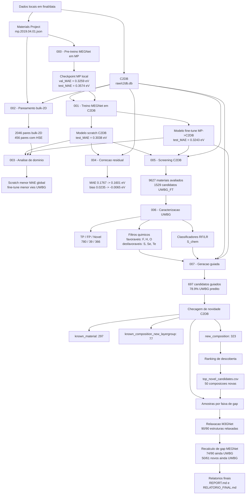
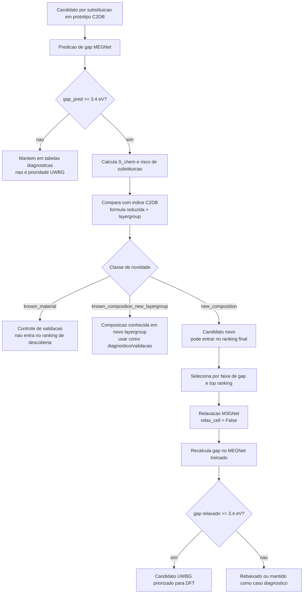

# Metodologia do TCC - Descoberta de materiais 2D UWBG

Este documento descreve o processo computacional implementado na pasta `final/`.
Ele consolida a metodologia, a sequencia dos experimentos, os criterios de
decisao, os artefatos produzidos e a logica usada para chegar aos candidatos
finais.

## Objetivo geral

O objetivo do trabalho e construir um pipeline autocontido para identificar e
priorizar materiais bidimensionais com band gap ultra-wide-bandgap (UWBG),
usando dados do C2DB, pre-treino em Materials Project, modelos MEGNet,
classificadores quimicos, geracao guiada por substituicao e relaxacao atomistica
com M3GNet.

Neste pipeline, um material e tratado como candidato UWBG quando o band gap HSE
predito e maior ou igual a `3.4 eV`.

## Diagrama geral do pipeline

## Diagrama de decisao para candidatos gerados

## Estrutura autocontida

A execucao foi organizada para que o necessario ao pipeline final fique dentro
de `final/`.

| Categoria | Local |
| --- | --- |
| Dados locais | `final/data` |
| Notebooks dos experimentos | `final/01_pretrain` a `final/08_guided_generation` |
| Funcoes compartilhadas | `final/common.py` |
| Outputs, logs, figuras e checkpoints | `final/runs` |
| Modelo M3GNet baixado | `final/models/M3GNet-PES-MatPES-PBE-2025.2` |
| Codigo MatGL usado pelo M3GNet | `final/vendor/matgl_src` |
| Relatorio final | `final/RELATORIO_FINAL.md` |
| Documento metodologico | `final/METODOLOGIA_TCC.md` |

O kernel usado foi `matgl-tcc`. Os notebooks resolvem caminhos a partir de
`final/common.py`, e os outputs sao gravados dentro de `final/runs`.

## Dados utilizados

### Materials Project

O arquivo `final/data/mp.2019.04.01.json` foi usado para pre-treinar um MEGNet
em uma base maior de materiais. Esse pre-treino gerou um checkpoint local usado
como inicializacao no experimento de fine-tuning.

### C2DB

O arquivo `final/data/raw/c2db.db` foi a base principal do trabalho. Ele foi usado
para:

- treinar modelos no dominio 2D;
- extrair estruturas e propriedades HSE/PBE;
- fazer screening de materiais;
- caracterizar candidatos UWBG;
- gerar prototipos para substituicao;
- verificar se um candidato gerado ja existia no proprio C2DB.

A base local contem 16.905 entradas estruturais. O pipeline de inferencia usa o
subconjunto com `ehull <= 0.2 eV/atom`, totalizando 9.627 materiais avaliados,
dos quais 3.070 possuem gap HSE conhecido.

### Dados DFT externos

Dois resultados DFT externos foram mantidos apenas como comparacao:

| Material | Gap DFT | Observacao |
| --- | ---: | --- |
| LiF | 8.46 eV | Composicao ja existente no C2DB em outros layergroups |
| BaF2 | 7.53 eV | Material ja existente no C2DB no mesmo layergroup do prototipo |

Eles nao foram usados para treino por serem apenas dois pontos e por terem sido
diagnosticados como casos de validacao/controle, nao como novas descobertas.

## Experimentos

### 000 - Pre-treino MEGNet em Materials Project

Objetivo: treinar um MEGNet em dados locais do Materials Project para obter uma
representacao inicial transferivel.

Configuracao principal:

- dados: `final/data/mp.2019.04.01.json`;
- `MAX_EPOCHS=180`;
- `PATIENCE=30`;
- `BATCH_SIZE=64`;
- `FORCE_RETRAIN=True`.

Resultado:

- melhor checkpoint: `best-epoch=168-val_MAE=0.3259.ckpt`;
- `test_MAE=0.3574 eV`;
- `test_RMSE=0.6189 eV`.

Interpretacao: o pre-treino convergiu e gerou um checkpoint local, mas a
transferencia para C2DB precisava ser validada porque MP e C2DB tem dominios e
targets diferentes.

### 001 - Treino MEGNet no C2DB

Objetivo: comparar treinamento do zero no C2DB contra fine-tuning a partir do
checkpoint MP.

Resultado:

| Modelo | Melhor val_MAE | Test MAE | Test RMSE |
| --- | ---: | ---: | ---: |
| Scratch C2DB | 0.2822 eV | 0.3038 eV | 0.4410 eV |
| Fine-tune MP->C2DB | 0.3120 eV | 0.3243 eV | 0.4725 eV |

Interpretacao: nesta execucao autocontida, o modelo scratch superou o
fine-tuning em MAE. Isso indicou que a transferencia MP -> C2DB nao era
automaticamente vantajosa nos parametros usados.

### 002 - Analise pareada bulk-2D

Objetivo: relacionar materiais 2D do C2DB com analogos bulk do MP para medir
diferencas entre dominios.

Resultado:

- 2046 pares bulk-2D totais;
- 2027 pares com PBE;
- 456 pares com HSE.

Interpretacao: havia cobertura suficiente para estudar transferencia, mas a
cobertura HSE pareada era menor. Isso justificou uma etapa explicita de analise
de dominio.

### 003 - Gap de dominio MEGNet

Objetivo: comparar scratch e fine-tune em materiais com informacao suficiente
para avaliar efeito de dominio.

Resultado:

| Modelo | MAE | RMSE | Bias | MAE_UWBG | Bias_UWBG |
| --- | ---: | ---: | ---: | ---: | ---: |
| MEGNet Scratch | 0.3077 | 0.4532 | 0.0002 | 0.3074 | -0.1099 |
| MEGNet Fine-tune | 0.3247 | 0.4820 | -0.0066 | 0.3133 | -0.0743 |

Interpretacao: o scratch manteve menor MAE global. O fine-tune reduziu o vies em
UWBG, mas nao reduziu MAE.

### 004 - Correcao residual

Objetivo: aprender o erro residual entre predicao MEGNet e HSE verdadeiro usando
descritores tabulares, sem retreinar o GNN.

Resultado:

- MAE baseline: `0.1767 eV`;
- MAE corrigido: `0.1601 eV`;
- reducao relativa de MAE: `9.4%`;
- bias: `0.0235 -> -0.0065 eV`.

Interpretacao: a correcao residual melhorou erro medio e bias, mas reduziu
levemente o recall UWBG. Portanto, ela e util para calibracao numerica, enquanto
o screening deve manter cuidado com falsos negativos.

### 005 - Inferencia e screening C2DB

Objetivo: aplicar os modelos treinados ao subconjunto filtrado do C2DB disponivel
para inferencia e organizar o screening UWBG.

Resultado:

- 9627 materiais avaliados;
- 3070 materiais com HSE conhecido;
- 1529 candidatos `UWBG_FT`;
- categorias mais frequentes: haletos, sulfetos, tiossais, selenetos e
  teluretos.

Interpretacao: o screening mostrou concentracao de candidatos UWBG em quimicas
com alta eletronegatividade, especialmente haletos, em acordo com a etapa de
caracterizacao quimica.

### 006 - Caracterizacao UWBG

Objetivo: caracterizar quimicamente os candidatos e treinar classificadores para
guiar a geracao.

Resultado:

- 1185 candidatos classificados;
- `TP=780`;
- `Novel=366`;
- `FP=39`;
- elementos favoraveis: `F`, `H`, `O`;
- elementos desfavoraveis: `S`, `Se`, `Te`;
- classificadores exportados: `rf_classifier.joblib` e `lr_classifier.joblib`;
- filtros exportados: `chemical_filters.json`.

Interpretacao: a assinatura quimica UWBG favoreceu elementos leves e
eletronegativos, e penalizou calcogenetos pesados. O classificador RF gerou o
score `S_chem`, usado para orientar a geracao.

### 007 - Geracao guiada, novidade C2DB e relaxacao

Objetivo: gerar candidatos por substituicao em prototipos C2DB, filtrar por
score quimico, predizer gap, classificar novidade e relaxar candidatos
selecionados.

Resultado:

- candidatos baseline: 1083;
- taxa UWBG baseline: 61.7%;
- candidatos guiados: 697;
- taxa UWBG guiada: 78.9%;
- `new_composition`: 323;
- `known_material`: 297;
- `known_composition_new_layergroup`: 77;
- top final: 50 candidatos, todos `new_composition`;
- relaxacao M3GNet: 90/90 estruturas relaxadas;
- delta medio pos-relaxacao: `-0.801 eV`;
- 74/90 relaxados ainda UWBG;
- 50/61 candidatos novos relaxados ainda UWBG.

Interpretacao: a geracao guiada aumentou a taxa de candidatos UWBG em relacao ao
baseline. A checagem de novidade impediu que materiais ja existentes fossem
tratados como descobertas. A relaxacao M3GNet mostrou que substituicoes sem
relaxacao podem superestimar o gap, mas muitos candidatos novos permaneceram
UWBG apos relaxacao.

## Criterios de novidade

A classificacao de novidade usa formula reduzida e layergroup do prototipo,
comparados contra o proprio C2DB.

| Classe | Definicao | Uso no pipeline |
| --- | --- | --- |
| `known_material` | Formula reduzida e layergroup ja existem no C2DB | Controle de validacao |
| `known_composition_new_layergroup` | Formula existe, mas nao naquele layergroup | Diagnostico/controle estrutural |
| `new_composition` | Formula reduzida nao existe no C2DB | Pode entrar no ranking de descoberta |

Essa regra foi introduzida apos a analise de LiF e BaF2. Esses materiais
pareciam candidatos gerados, mas na pratica nao deveriam ser tratados como novas
descobertas.

## Relaxacao M3GNet

A relaxacao foi adicionada para reduzir o erro causado por usar geometrias de
prototipos apos substituicao direta. A estrategia foi:

1. gerar a estrutura substituida;
2. predizer o gap com o MEGNet treinado;
3. selecionar candidatos por faixa de gap e top ranking;
4. relaxar posicoes atomicas com M3GNet;
5. manter `relax_cell=False` para preservar a celula e o vacuo 2D;
6. recalcular o gap com o mesmo MEGNet usado antes da relaxacao.

O M3GNet foi executado em subprocesso, usando:

- modelo local: `final/models/M3GNet-PES-MatPES-PBE-2025.2`;
- codigo MatGL vendorizado: `final/vendor/matgl_src`;
- script: `final/08_guided_generation/relax_m3gnet_batch.py`.

Isso evita misturar no mesmo kernel a versao de MatGL usada no treino MEGNet e a
versao necessaria para carregar o M3GNet PES baixado.

## Validacao externa com LiF e BaF2

Os dois resultados DFT externos foram usados apenas como comparacao. Depois da
relaxacao, o erro caiu fortemente:

| Material | Gap original | Gap relaxado | Gap DFT | Erro original | Erro relaxado |
| --- | ---: | ---: | ---: | ---: | ---: |
| LiF | 9.624 | 8.414 | 8.460 | +1.164 | -0.046 |
| BaF2 | 8.177 | 7.431 | 7.530 | +0.647 | -0.099 |

Interpretacao: nesses dois casos, a superestimacao vinha majoritariamente da
geometria nao relaxada, nao necessariamente de uma falha intrinseca do modelo de
gap.

## Principais artefatos

| Artefato | Descricao |
| --- | --- |
| `final/runs/000_megnet_pretrain_mp/model` | Checkpoints do pre-treino MP |
| `final/runs/001_megnet_finetune_c2db/model` | Checkpoints scratch e fine-tune C2DB |
| `final/runs/005_inference_screening/outputs/all_materials_predictions.csv` | Predicoes no subconjunto C2DB filtrado e avaliado |
| `final/runs/006_uwbg_characterization/outputs/chemical_filters.json` | Filtros quimicos UWBG |
| `final/runs/006_uwbg_characterization/outputs/rf_classifier.joblib` | Classificador RF usado como `S_chem` |
| `final/runs/007_guided_generation/outputs/candidates_guided.csv` | Todos candidatos guiados anotados |
| `final/runs/007_guided_generation/outputs/candidates_new_composition.csv` | Candidatos com composicao nova |
| `final/runs/007_guided_generation/outputs/top_novel_candidates.csv` | Ranking final de descoberta |
| `final/runs/007_guided_generation/outputs/gap_bin_samples_all.csv` | Amostras por faixa, incluindo controles conhecidos |
| `final/runs/007_guided_generation/outputs/gap_bin_samples_new_composition.csv` | Amostras por faixa, apenas composicoes novas |
| `final/runs/007_guided_generation/outputs/relaxation_results.csv` | Resultado das relaxacoes e gaps recalculados |
| `final/runs/007_guided_generation/outputs/external_dft_comparison.csv` | Comparacao externa LiF/BaF2 |
| `final/RELATORIO_FINAL.md` | Sumario final dos resultados |

## Ordem de reproducao

Execute os notebooks em ordem com o kernel `matgl-tcc`:

1. `final/01_pretrain/megnet_pretrain_mp.ipynb`
2. `final/02_finetune_c2db/megnet_finetune_c2db.ipynb`
3. `final/03_bulk2d_analysis/bulk2d_paired_analysis.ipynb`
4. `final/04_domain_gap/megnet_domain_analysis.ipynb`
5. `final/06_residual_correction/residual_correction.ipynb`
6. `final/05_inference_screening/inference_comparison.ipynb`
7. `final/07_uwbg_characterization/uwbg_characterization.ipynb`
8. `final/08_guided_generation/guided_generation.ipynb`

Observacao: a numeracao dos runs segue a historia final dos experimentos. O
screening e a correcao residual podem ser lidos como etapas complementares; a
geracao final depende diretamente dos artefatos do screening/caracterizacao e
dos checkpoints MEGNet.

## Conclusao metodologica

O pipeline final combina quatro niveis de triagem:

1. aprendizado de gap com MEGNet;
2. classificacao quimica UWBG via `S_chem`;
3. checagem de novidade contra o proprio C2DB;
4. relaxacao atomistica e recalculo de gap.

Essa combinacao evita tratar materiais ja existentes como descobertas, reduz a
superestimacao causada por geometrias nao relaxadas e produz uma lista final de
candidatos `new_composition` mais defensavel para validacao DFT.
