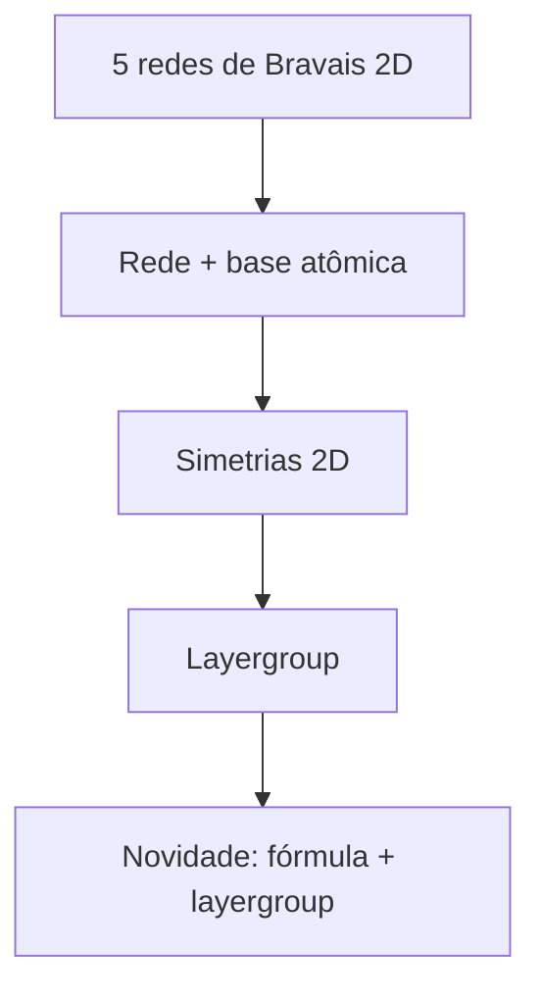

# Figura 02 - Redes de Bravais 2D e layergroups

## Status

Criar figura nova.

## Diretrizes visuais

- Reduzir o texto dentro da figura ao mínimo necessário; detalhes devem ir na legenda ou no texto do TCC.
- Não usar emojis. Se precisar de marcação visual, usar ícones simples, setas, cores ou símbolos científicos.
- Não criar blocos finais de resumo, checklist ou explicações longas dentro da figura.
- Priorizar leitura rápida: poucas etapas, rótulos curtos, boa hierarquia visual e espaçamento amplo.

## Regra de conteúdo do prompt

- Este markdown deve conter toda a informação necessária para criar a figura corretamente.
- Nem toda informação deste markdown deve virar texto dentro da figura; a imagem deve mostrar a informação por composição visual, rótulos curtos, números essenciais e legenda.
- Quando houver muitos detalhes, separar: o que aparece como desenho, o que aparece como rótulo curto, o que aparece como número e o que deve ficar somente na legenda ou no texto do TCC.

## Onde entra no TCC

Fundamentação teórica, na seção sobre estruturas cristalinas e redes de Bravais em 2D. Também serve como ponte para a metodologia de checagem de novidade por fórmula e layergroup.

## Objetivo

Explicar que a estrutura cristalina 2D é descrita por uma rede periódica, uma base atômica e operações de simetria. A figura deve deixar claro que o layergroup não é o mesmo que a fórmula química.

## Mensagem principal

Dois materiais podem ter a mesma composição química e ainda assim representar protótipos estruturais diferentes se tiverem layergroups distintos. Por isso, no trabalho, a novidade é avaliada combinando fórmula reduzida e layergroup.

## Layout recomendado

Use dois níveis visuais.

No topo, mostrar as cinco redes de Bravais em 2D:

- Oblíqua.
- Retangular.
- Retangular centrada.
- Quadrada.
- Hexagonal.

Em cada rede, desenhar os vetores primitivos `a1` e `a2`.

Na parte inferior, mostrar uma rede com uma base atômica e elementos de simetria, levando ao conceito de layergroup. Use uma seta:

`Rede de Bravais + base atômica + simetrias 2D/fora do plano -> layergroup`

## Diagrama base



## Informação que a figura deve mostrar

- As cinco redes de Bravais 2D em miniaturas.
- Os vetores primitivos `a1` e `a2`.
- Uma base atômica adicionada à rede.
- Pelo menos uma operação de simetria desenhada de modo simples.
- O resultado como `layergroup`.
- A ligação metodológica com a checagem de novidade por fórmula reduzida e layergroup.

## Texto que pode aparecer na figura

- `oblíqua`
- `retangular`
- `retangular centrada`
- `quadrada`
- `hexagonal`
- `base`
- `simetria`
- `layergroup`
- `fórmula + layergroup`

Detalhes matemáticos devem ficar na legenda.

## Elementos visuais obrigatórios

- Cinco painéis pequenos com redes de Bravais 2D.
- Vetores `a1` e `a2` desenhados em pelo menos um painel.
- Representação de base atômica com dois ou três tipos de átomos.
- Indicação de operações de simetria por ícones simples, como espelho, rotação ou inversão.
- Bloco final com exemplos de layergroup, como `p-3m1`, `p-6m2`, `p4/nmm` e `pmmn`.

## Fórmulas a incluir

Se houver espaço, inserir a relação:

```tex
\mathbf{R} = n_1 \mathbf{a}_1 + n_2 \mathbf{a}_2
```

Explicar na legenda:

- `R` é um vetor de translação da rede.
- `a1` e `a2` são os vetores primitivos no plano.
- `n1` e `n2` são inteiros.

## Ligação com a metodologia

Adicionar um pequeno quadro lateral:

`Novidade no C2DB = fórmula reduzida + layergroup`

Nesse quadro, mostrar três casos:

- Mesma fórmula e mesmo layergroup: material já conhecido.
- Mesma fórmula e outro layergroup: composição conhecida em novo protótipo.
- Fórmula ausente no C2DB: nova composição.

## Cuidados

- Não confundir layergroup com space group 3D.
- Não colocar todos os layergroups possíveis; isso deixaria a figura poluída.
- Manter a figura didática, não enciclopédica.
