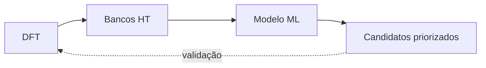

# Figura 05 - DFT, high-throughput e aprendizado de máquina

## Status

Criar figura nova.

## Diretrizes visuais

- Reduzir o texto dentro da figura ao mínimo necessário; detalhes devem ir na legenda ou no texto do TCC.
- Não usar emojis. Se precisar de marcação visual, usar ícones simples, setas, cores ou símbolos científicos.
- Não criar blocos finais de resumo, checklist ou explicações longas dentro da figura.
- Priorizar leitura rápida: poucas etapas, rótulos curtos, boa hierarquia visual e espaçamento amplo.

## Regra de conteúdo do prompt

- Este markdown deve conter toda a informação necessária para criar a figura corretamente.
- Nem toda informação deste markdown deve virar texto dentro da figura; a imagem deve mostrar a informação por composição visual, rótulos curtos, números essenciais e legenda.
- Quando houver muitos detalhes, separar: o que aparece como desenho, o que aparece como rótulo curto, o que aparece como número e o que deve ficar somente na legenda ou no texto do TCC.

## Onde entra no TCC

Fundamentação teórica, antes ou no início da seção de aprendizado de máquina aplicado à ciência de materiais.

## Objetivo

Mostrar por que o trabalho combina bancos de dados de DFT, triagem high-throughput e modelos de aprendizado de máquina.

## Mensagem principal

DFT fornece dados físicos confiáveis, mas tem custo computacional elevado, especialmente para cálculos de maior fidelidade como HSE. Modelos de aprendizado de máquina permitem aproximar propriedades eletrônicas em escala muito maior, funcionando como filtros para priorizar candidatos para validação posterior.

## Layout recomendado

Usar um fluxo horizontal com quatro estágios:

1. `Cálculos DFT`.
2. `Bancos de dados HT`.
3. `Modelo ML`.
4. `Candidatos priorizados para validação`.

Adicionar setas de custo/escala:

- DFT: `alto custo`, `alta fidelidade`.
- ML: `baixo custo por predição`, `alta escala`.

## Diagrama base

Na figura, cada bloco deve ter no máximo duas palavras principais e uma anotação curta. A explicação sobre custo computacional deve ficar na legenda, não em caixas extras.

## Elementos visuais obrigatórios

- Ícone ou representação de cálculo DFT.
- Banco de dados com rótulos `Materials Project` e `C2DB`.
- Modelo de aprendizado de máquina como bloco preditivo.
- Lista ou funil de candidatos.
- Seta de retorno indicando que candidatos finais podem ser validados com DFT.

## Texto interno sugerido

- `DFT / PBE / HSE`
- `Dados estruturais + propriedades`
- `Treino supervisionado`
- `Predição rápida de Eg`
- `Seleção para DFT`

## Relação com este TCC

No canto inferior, incluir uma faixa discreta:

`MP -> pré-treino | C2DB -> ajuste 2D | MEGNet -> predição de bandgap HSE | M3GNet -> relaxação estrutural`

## Cuidados

- Não sugerir que ML substitui DFT em todos os casos.
- Representar ML como filtro e priorizador, não como prova final.
- Separar visualmente propriedade eletrônica (`bandgap`) de relaxação estrutural.
