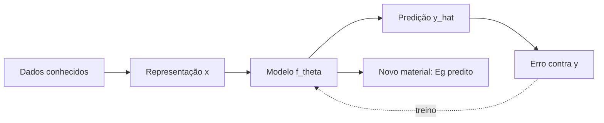

# Figura 06 - Aprendizado supervisionado em materiais

## Status

Criar figura nova.

## Diretrizes visuais

- Reduzir o texto dentro da figura ao mínimo necessário; detalhes devem ir na legenda ou no texto do TCC.
- Não usar emojis. Se precisar de marcação visual, usar ícones simples, setas, cores ou símbolos científicos.
- Não criar blocos finais de resumo, checklist ou explicações longas dentro da figura.
- Priorizar leitura rápida: poucas etapas, rótulos curtos, boa hierarquia visual e espaçamento amplo.

## Regra de conteúdo do prompt

- Este markdown deve conter toda a informação necessária para criar a figura corretamente.
- Nem toda informação deste markdown deve virar texto dentro da figura; a imagem deve mostrar a informação por composição visual, rótulos curtos, números essenciais e legenda.
- Quando houver muitos detalhes, separar: o que aparece como desenho, o que aparece como rótulo curto, o que aparece como número e o que deve ficar somente na legenda ou no texto do TCC.

## Onde entra no TCC

Fundamentação teórica, na introdução da seção de aprendizado de máquina para ciência de materiais.

## Objetivo

Explicar o conceito de aprendizado de máquina supervisionado no contexto do TCC antes de entrar em redes neurais de grafos.

## Mensagem principal

O modelo aprende uma função que associa uma representação do material a uma propriedade alvo. Neste trabalho, a entrada é a estrutura/composição do material e o alvo principal é o bandgap HSE em eV.

## Layout recomendado

Criar um diagrama com duas partes:

1. Treinamento.
2. Inferência ou uso do modelo.

Na parte de treinamento:

`materiais conhecidos -> representação x_i -> modelo f_theta -> predição y_hat_i -> comparação com y_i -> atualização dos parâmetros`

Na parte de inferência:

`novo material -> modelo treinado -> bandgap predito`

## Diagrama base



Separar visualmente o ciclo de treino da predição final. Não colocar longas definições das variáveis dentro da figura; a legenda deve explicar `x`, `y`, `theta` e `y_hat`.

## Elementos visuais obrigatórios

- Conjunto de pares de treino `(x_i, y_i)`.
- Representação de material como estrutura ou grafo.
- Modelo `f_theta`.
- Saída `\hat{y}`.
- Métricas `MAE` e `RMSE`.
- Separação treino/validação/teste.

## Fórmulas a incluir

```tex
\hat{y}_i = f_\theta(x_i)
```

Legenda:

- `x_i` é a representação do material `i`.
- `y_i` é o valor alvo conhecido, aqui o bandgap HSE.
- `f_theta` é o modelo com parâmetros treináveis `theta`.
- `\hat{y}_i` é a predição do modelo.

Também pode incluir:

```tex
\mathrm{MAE} = \frac{1}{N}\sum_i |y_i - \hat{y}_i|
```

Legenda:

- `N` é o número de amostras avaliadas.
- `MAE` mede o erro médio absoluto em eV.

## Cuidados

- Evitar detalhar MEGNet ainda; essa figura é introdutória.
- Não chamar a predição de verdade física final.
- Mostrar que validação/teste são separados do treino.
