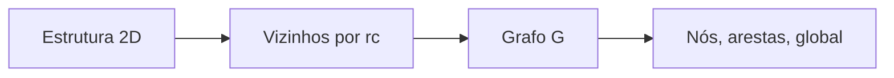

# Figura 07 - Representação de estrutura cristalina como grafo

## Status

Criar figura nova.

## Diretrizes visuais

- Reduzir o texto dentro da figura ao mínimo necessário; detalhes devem ir na legenda ou no texto do TCC.
- Não usar emojis. Se precisar de marcação visual, usar ícones simples, setas, cores ou símbolos científicos.
- Não criar blocos finais de resumo, checklist ou explicações longas dentro da figura.
- Priorizar leitura rápida: poucas etapas, rótulos curtos, boa hierarquia visual e espaçamento amplo.

## Regra de conteúdo do prompt

- Este markdown deve conter toda a informação necessária para criar a figura corretamente.
- Nem toda informação deste markdown deve virar texto dentro da figura; a imagem deve mostrar a informação por composição visual, rótulos curtos, números essenciais e legenda.
- Quando houver muitos detalhes, separar: o que aparece como desenho, o que aparece como rótulo curto, o que aparece como número e o que deve ficar somente na legenda ou no texto do TCC.

## Onde entra no TCC

Fundamentação teórica, na seção de redes neurais de grafos e representação de materiais.

## Objetivo

Mostrar como uma estrutura cristalina 2D é convertida em grafo para ser usada por modelos como MEGNet.

## Mensagem principal

Átomos são representados como nós, vizinhanças atômicas como arestas e informações globais como estado do sistema. Essa representação preserva relações locais importantes para a predição de propriedades.

## Layout recomendado

Usar um fluxo em quatro blocos:

1. Estrutura cristalina 2D com célula unitária.
2. Construção de vizinhos usando raio de corte `rc`.
3. Grafo com nós e arestas.
4. Atributos de nós, arestas e estado global.

## Diagrama base



A figura deve ser majoritariamente visual: célula cristalina, raio de corte e grafo. As fórmulas podem aparecer pequenas ou ficar no texto, se comprometerem a legibilidade.

## Elementos visuais obrigatórios

- Célula unitária 2D com átomos coloridos por elemento.
- Ligações ou conexões até um raio de corte.
- Imagens periódicas vizinhas para indicar PBC.
- Grafo final com nós `v_i` e arestas `e_ij`.
- Distância interatômica `d_ij` indicada em uma aresta.
- Bloco de atributos:
  - Nó: tipo químico ou embedding elementar.
  - Aresta: distância e expansão radial.
  - Global: estado `u`, se usado.

## Fórmulas a incluir

```tex
G = (V, E, u)
```

Legenda:

- `G` é o grafo do material.
- `V` é o conjunto de nós atômicos.
- `E` é o conjunto de arestas entre vizinhos.
- `u` representa atributos globais.

Também incluir a expansão radial se ela estiver no texto:

```tex
\mathrm{RBF}_k(d_{ij}) = \exp[-\beta_k(d_{ij}-\mu_k)^2]
```

Legenda:

- `d_ij` é a distância entre os átomos `i` e `j`.
- `mu_k` é o centro da função radial `k`.
- `beta_k` controla a largura da função radial.

## Cuidados

- Não desenhar ligações químicas como se fossem necessariamente covalentes; são conexões de vizinhança para o grafo.
- Indicar periodicidade, pois materiais cristalinos não são moléculas isoladas.
- Evitar excesso de texto dentro do diagrama.
