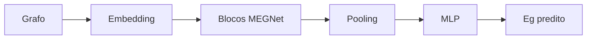

# Figura 08 - Bloco de atualização MEGNet

## Status

Criar figura nova.

## Diretrizes visuais

- Reduzir o texto dentro da figura ao mínimo necessário; detalhes devem ir na legenda ou no texto do TCC.
- Não usar emojis. Se precisar de marcação visual, usar ícones simples, setas, cores ou símbolos científicos.
- Não criar blocos finais de resumo, checklist ou explicações longas dentro da figura.
- Priorizar leitura rápida: poucas etapas, rótulos curtos, boa hierarquia visual e espaçamento amplo.

## Regra de conteúdo do prompt

- Este markdown deve conter toda a informação necessária para criar a figura corretamente.
- Nem toda informação deste markdown deve virar texto dentro da figura; a imagem deve mostrar a informação por composição visual, rótulos curtos, números essenciais e legenda.
- Quando houver muitos detalhes, separar: o que aparece como desenho, o que aparece como rótulo curto, o que aparece como número e o que deve ficar somente na legenda ou no texto do TCC.

## Onde entra no TCC

Fundamentação teórica, após a explicação de grafos cristalinos.

## Objetivo

Explicar de forma visual como o MEGNet atualiza informações de arestas, nós e estado global para predizer uma propriedade do material.

## Mensagem principal

O MEGNet usa passagem de mensagens em grafos. As informações de ligações, átomos e estado global são atualizadas em blocos sucessivos e depois agregadas para gerar a predição de bandgap.

## Layout recomendado

Usar um diagrama de arquitetura em fluxo:

`Grafo de entrada -> embedding -> bloco MEGNet x N -> pooling -> MLP -> Eg predito`

Dentro do bloco MEGNet, mostrar três atualizações empilhadas:

1. Atualização de arestas.
2. Atualização de nós.
3. Atualização global.

## Diagrama base



Dentro de `Blocos MEGNet`, usar três linhas curtas: `arestas`, `nós`, `global`. As equações completas podem ficar no texto do TCC; na figura, preferir nomes das operações.

## Elementos visuais obrigatórios

- Grafo inicial com nós e arestas.
- Bloco `MEGNet`.
- Setas de mensagem entre arestas, nós e estado global.
- Repetição `N blocos`.
- Pooling/agregação.
- Saída `\hat{E}_g (eV)`.

## Equações conceituais a incluir

As equações podem ser apresentadas de forma simplificada:

```tex
e'_{ij} = \phi_e(e_{ij}, v_i, v_j, u)
```

```tex
v'_i = \phi_v(v_i, \sum_j e'_{ij}, u)
```

```tex
u' = \phi_u(u, \sum_i v'_i, \sum_{ij} e'_{ij})
```

Legenda:

- `e_ij` são atributos de aresta.
- `v_i` e `v_j` são atributos dos nós atômicos.
- `u` é o estado global.
- `phi_e`, `phi_v` e `phi_u` são redes neurais de atualização.

## Dados específicos do TCC

Se a figura tiver um quadro lateral, incluir:

- Arquitetura usada: MEGNet.
- Alvo: bandgap HSE em eV.
- Uso: predição antes e depois da relaxação.
- Entrada: estrutura cristalina 2D convertida em grafo.

Não colocar todos os hiperparâmetros na figura principal; eles devem ficar no texto ou tabela.

## Cuidados

- Não confundir MEGNet com M3GNet.
- Não sugerir que o MEGNet relaxa estrutura; ele prediz bandgap.
- Evitar equações muito longas dentro do desenho.
