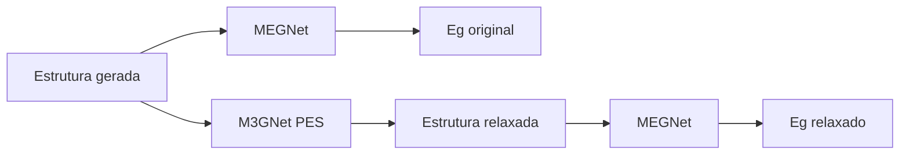

# Figura 09 - Diferença entre MEGNet e M3GNet no TCC

## Status

Criar figura nova.

## Diretrizes visuais

- Reduzir o texto dentro da figura ao mínimo necessário; detalhes devem ir na legenda ou no texto do TCC.
- Não usar emojis. Se precisar de marcação visual, usar ícones simples, setas, cores ou símbolos científicos.
- Não criar blocos finais de resumo, checklist ou explicações longas dentro da figura.
- Priorizar leitura rápida: poucas etapas, rótulos curtos, boa hierarquia visual e espaçamento amplo.

## Regra de conteúdo do prompt

- Este markdown deve conter toda a informação necessária para criar a figura corretamente.
- Nem toda informação deste markdown deve virar texto dentro da figura; a imagem deve mostrar a informação por composição visual, rótulos curtos, números essenciais e legenda.
- Quando houver muitos detalhes, separar: o que aparece como desenho, o que aparece como rótulo curto, o que aparece como número e o que deve ficar somente na legenda ou no texto do TCC.

## Onde entra no TCC

Metodologia ou resultados, antes da seção de relaxação estrutural. A figura também pode ser usada para responder à dúvida central: relaxar estrutura não significa trocar o modelo de predição de bandgap.

## Objetivo

Deixar claro que o trabalho usa dois modelos com funções diferentes:

- MEGNet: predição de bandgap.
- M3GNet: relaxação estrutural via potencial interatômico.

## Mensagem principal

O M3GNet altera a geometria do candidato ao minimizar forças, mas não prediz o bandgap final. Após a relaxação, o bandgap é reavaliado pelo mesmo tipo de modelo MEGNet usado para predição eletrônica.

## Layout recomendado

Usar duas trilhas paralelas que se encontram em um fluxo final.

Trilha superior:

`estrutura candidata -> MEGNet -> gap predito antes da relaxação`

Trilha inferior:

`estrutura candidata -> M3GNet PES -> estrutura relaxada`

Fluxo final:

`estrutura relaxada -> MEGNet -> gap predito após relaxação`

## Diagrama base

Usar cores diferentes para os dois modelos: uma cor para predição eletrônica e outra para relaxação estrutural. Não usar caixas explicativas longas dentro da figura.

## Elementos visuais obrigatórios

- Bloco MEGNet com rótulo `modelo eletrônico`.
- Bloco M3GNet com rótulo `potencial interatômico / PES`.
- Estrutura antes da relaxação.
- Estrutura depois da relaxação.
- Saídas:
  - `E_g^pred original`.
  - `estrutura relaxada`.
  - `E_g^pred relaxado`.

## Texto interno sugerido

- `MEGNet prediz bandgap HSE`
- `M3GNet calcula energia/forças e relaxa posições`
- `M3GNet não prediz Eg`
- `Mesmo modelo de gap é usado antes e depois`

## Dados específicos a incluir se houver espaço

- Modelo M3GNet baixado localmente: `materialyze/M3GNet-PES-MatPES-PBE-2025.2`.
- Relaxação com célula fixa: `relax_cell=False`.
- Resultado do estudo: `90/90` estruturas relaxadas, `74/90` ainda UWBG, `50/61` novas composições ainda UWBG.

## Cuidados

- Não representar M3GNet como modelo de bandgap.
- Não sugerir que a relaxação torna a predição equivalente a DFT.
- Não misturar a correção residual como etapa obrigatória nesta figura.
