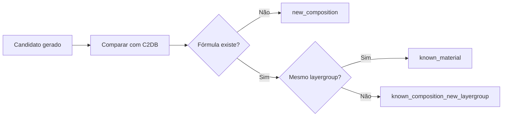

# Figura 10 - Critério de novidade contra o C2DB

## Status

Criar figura nova.

## Diretrizes visuais

- Reduzir o texto dentro da figura ao mínimo necessário; detalhes devem ir na legenda ou no texto do TCC.
- Não usar emojis. Se precisar de marcação visual, usar ícones simples, setas, cores ou símbolos científicos.
- Não criar blocos finais de resumo, checklist ou explicações longas dentro da figura.
- Priorizar leitura rápida: poucas etapas, rótulos curtos, boa hierarquia visual e espaçamento amplo.

## Regra de conteúdo do prompt

- Este markdown deve conter toda a informação necessária para criar a figura corretamente.
- Nem toda informação deste markdown deve virar texto dentro da figura; a imagem deve mostrar a informação por composição visual, rótulos curtos, números essenciais e legenda.
- Quando houver muitos detalhes, separar: o que aparece como desenho, o que aparece como rótulo curto, o que aparece como número e o que deve ficar somente na legenda ou no texto do TCC.

## Onde entra no TCC

Metodologia e resultados, na seção de geração de candidatos e validação contra materiais já existentes no C2DB.

## Objetivo

Explicar como o trabalho diferencia material já conhecido, composição conhecida em novo layergroup e composição nova.

## Mensagem principal

Um candidato gerado só é considerado nova composição quando sua fórmula reduzida não aparece no C2DB. Se a fórmula aparece, o layergroup define se ele é o mesmo material/protótipo já conhecido ou apenas uma variação estrutural de composição conhecida.

## Layout recomendado

Usar uma árvore de decisão.

O fluxo deve ser lido da esquerda para a direita e de cima para baixo. Evitar retorno visual para a esquerda, porque isso dificulta a leitura.

## Diagrama base

Na figura final, os diamantes devem conter apenas as perguntas curtas:

- `Fórmula existe?`
- `Mesmo layergroup?`

As explicações detalhadas devem ficar na legenda ou no texto.

## Elementos visuais obrigatórios

- Caixa de entrada: `candidato gerado`.
- Comparação com C2DB.
- Chaves de comparação:
  - Fórmula reduzida.
  - Layergroup.
- Três classes de saída:
  - `known_material`.
  - `known_composition_new_layergroup`.
  - `new_composition`.

## Exemplos do TCC a incluir

Incluir no máximo dois exemplos pequenos no rodapé, com texto curto:

- `BaF2`: classificado como `known_material`, pois já havia BaF2 no C2DB com o layergroup correspondente.
- `LiF`: classificado como `known_composition_new_layergroup`, pois a composição é conhecida, mas o protótipo/layergroup gerado não corresponde ao material final desejado.

Se mencionar `LiF`, destacar que ele foi útil para diagnosticar problema de geração/ranking, não como nova descoberta.

## Ajustes sobre a versão exemplo

- Trocar rótulos genéricos como `LG-35` e `LG-112` pelos layergroups reais das tabelas finais.
- Evitar ícones com aparência de emoji, como estrela ou check grande. Usar badges simples, contornos ou ícones lineares.
- Usar verde apenas para `new_composition`.
- Usar amarelo para `known_composition_new_layergroup`.
- Usar cinza ou azul para `known_material`, pois é controle/material conhecido, não erro.
- Reduzir o texto nos cartões de saída para uma linha principal; explicações ficam na legenda.

## Cuidados

- Não chamar toda substituição química de material novo.
- Não tratar fórmula sozinha como critério suficiente de novidade estrutural.
- Não confundir layergroup com espaço de grupo 3D.
