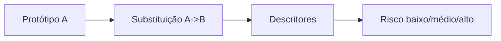

# Figura 11 - Risco de substituição química

## Status

Criar figura nova.

## Diretrizes visuais

- Reduzir o texto dentro da figura ao mínimo necessário; detalhes devem ir na legenda ou no texto do TCC.
- Não usar emojis. Se precisar de marcação visual, usar ícones simples, setas, cores ou símbolos científicos.
- Não criar blocos finais de resumo, checklist ou explicações longas dentro da figura.
- Priorizar leitura rápida: poucas etapas, rótulos curtos, boa hierarquia visual e espaçamento amplo.

## Regra de conteúdo do prompt

- Este markdown deve conter toda a informação necessária para criar a figura corretamente.
- Nem toda informação deste markdown deve virar texto dentro da figura; a imagem deve mostrar a informação por composição visual, rótulos curtos, números essenciais e legenda.
- Quando houver muitos detalhes, separar: o que aparece como desenho, o que aparece como rótulo curto, o que aparece como número e o que deve ficar somente na legenda ou no texto do TCC.

## Onde entra no TCC

Metodologia, na etapa de geração guiada por substituições químicas. Também pode aparecer nos resultados para explicar por que alguns candidatos são mais confiáveis do que outros.

## Objetivo

Explicar a métrica heurística de risco de substituição usada para priorizar candidatos e interpretar resultados.

## Mensagem principal

O risco de substituição mede o quanto a troca atômica proposta se afasta de substituições quimicamente conservadoras. Ele não prova estabilidade nem instabilidade; é um critério auxiliar para ranqueamento e diagnóstico.

## Layout recomendado

Usar uma figura em três partes:

1. Protótipo original com átomo `A`.
2. Substituição proposta `A -> B`.
3. Avaliação de risco em escala verde-amarelo-vermelho.

Ao lado da escala, mostrar os descritores comparados.

## Diagrama base

Na figura final, a escala de risco deve ser visual, com cor e posição. Evitar textos longos explicando cada descritor dentro do desenho.

## Elementos visuais obrigatórios

- Estrutura/protótipo com um átomo destacado.
- Seta de substituição `A -> B`.
- Cartões de critérios:
  - Diferença de eletronegatividade.
  - Diferença de raio atômico ou covalente.
  - Relação de grupo/família química.
  - Compatibilidade de valência ou ambiente químico.
  - Frequência ou plausibilidade da substituição no conjunto de dados, se usada.
- Escala:
  - Baixo risco.
  - Médio risco.
  - Alto risco.

## Exemplos sugeridos

Usar exemplos pequenos, sem transformar a figura em tabela:

- Baixo risco: substituições entre elementos quimicamente próximos, como halogênio por halogênio de tamanho semelhante ou metais do mesmo grupo.
- Médio risco: troca com alguma diferença de raio ou eletronegatividade, mas ainda plausível.
- Alto risco: `Br -> F` em protótipos onde a mudança geométrica é grande, ou trocas que alteram muito raio, valência ou ambiente local.

Se usar LiF e BaF2 como exemplos, deixar claro:

- O alto risco ajudou a diagnosticar por que a geometria não relaxada superestimava o gap.
- O risco não invalida automaticamente um candidato, mas exige validação mais cuidadosa.

## Texto interno sugerido

- `Substituição conservadora`
- `Substituição agressiva`
- `Risco usado no ranking`
- `Não é critério absoluto`

## Cuidados

- Não apresentar `substitution_risk` como métrica física rigorosa.
- Não usar risco como substituto de DFT ou relaxação.
- Não confundir risco de substituição com score químico `S_chem`.
