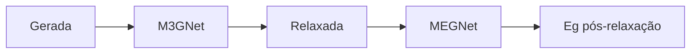

# Figura 12 - Relaxação estrutural com M3GNet

## Status

Criar figura nova.

## Diretrizes visuais

- Reduzir o texto dentro da figura ao mínimo necessário; detalhes devem ir na legenda ou no texto do TCC.
- Não usar emojis. Se precisar de marcação visual, usar ícones simples, setas, cores ou símbolos científicos.
- Não criar blocos finais de resumo, checklist ou explicações longas dentro da figura.
- Priorizar leitura rápida: poucas etapas, rótulos curtos, boa hierarquia visual e espaçamento amplo.

## Regra de conteúdo do prompt

- Este markdown deve conter toda a informação necessária para criar a figura corretamente.
- Nem toda informação deste markdown deve virar texto dentro da figura; a imagem deve mostrar a informação por composição visual, rótulos curtos, números essenciais e legenda.
- Quando houver muitos detalhes, separar: o que aparece como desenho, o que aparece como rótulo curto, o que aparece como número e o que deve ficar somente na legenda ou no texto do TCC.

## Onde entra no TCC

Metodologia e resultados, na etapa de validação estrutural dos candidatos gerados.

## Objetivo

Mostrar o que significa relaxar uma estrutura e por que essa etapa é importante antes de interpretar o bandgap predito.

## Mensagem principal

A geração por substituição pode produzir geometrias não relaxadas. A relaxação move os átomos para reduzir forças e obter uma geometria mais plausível. Depois disso, o bandgap é recalculado pelo modelo eletrônico.

## Layout recomendado

Usar um fluxo antes/depois:

`estrutura gerada não relaxada -> M3GNet PES -> estrutura relaxada -> MEGNet -> gap pós-relaxação`

Adicionar uma pequena representação de forças:

- Setas sobre átomos antes da relaxação.
- Átomos reposicionados depois da relaxação.
- Forças menores ou ausentes no painel relaxado.

## Diagrama base

A figura deve mostrar a mudança geométrica com desenhos de estrutura, não com texto. O detalhe sobre energia/forças fica na legenda.

## Elementos visuais obrigatórios

- Estrutura inicial com átomos deslocados ou ligações tensionadas.
- Vetores de força sobre alguns átomos.
- Bloco `M3GNet PES`.
- Estrutura final relaxada.
- Indicação `relax_cell=False`, se a metodologia final manteve a célula fixa.
- Bloco final `MEGNet gap model`.

## Dados do TCC a incluir

Adicionar no rodapé ou em caixas pequenas:

- `90/90` estruturas relaxadas.
- `74/90` continuaram UWBG após relaxação.
- `50/61` novas composições continuaram UWBG após relaxação.
- Variação média do gap após relaxação: aproximadamente `-0.801 eV`, se esse valor estiver mantido nos resultados finais.

## Cuidados

- Não desenhar relaxação como se fosse cálculo DFT completo.
- Não sugerir que M3GNet substitui HSE.
- Não omitir que o modelo de bandgap é reaplicado após relaxação.
