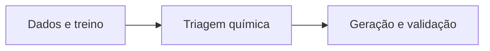

# Figura 15 - Atualização de resumo_visao_geral.png

## Status

Atualizar figura existente.

## Diretrizes visuais

- Reduzir o texto dentro da figura ao mínimo necessário; detalhes devem ir na legenda ou no texto do TCC.
- Não usar emojis. Se precisar de marcação visual, usar ícones simples, setas, cores ou símbolos científicos.
- Não criar blocos finais de resumo, checklist ou explicações longas dentro da figura.
- Priorizar leitura rápida: poucas etapas, rótulos curtos, boa hierarquia visual e espaçamento amplo.

## Regra de conteúdo do prompt

- Este markdown deve conter toda a informação necessária para criar a figura corretamente.
- Nem toda informação deste markdown deve virar texto dentro da figura; a imagem deve mostrar a informação por composição visual, rótulos curtos, números essenciais e legenda.
- Quando houver muitos detalhes, separar: o que aparece como desenho, o que aparece como rótulo curto, o que aparece como número e o que deve ficar somente na legenda ou no texto do TCC.

## Arquivos atuais

- `final/figures/visao_geral.png`
- `tcc-text/figures/resumo_visao_geral.png`

Esses arquivos têm o mesmo conteúdo e representam a visão geral metodológica do TCC.

## Diagnóstico da versão atual

A figura atual está conceitualmente boa: divide o trabalho em três painéis.

1. Dados e treinamento dos modelos.
2. Triagem e aprendizado químico.
3. Geração guiada e validação.

O problema principal é densidade visual. Há muito texto pequeno e alguns rótulos podem ficar pouco legíveis na versão impressa. A versão final deve preservar a lógica, mas simplificar a composição.

## Objetivo da atualização

Transformar a figura em uma visão geral de alto nível, adequada para abertura da metodologia ou resumo gráfico do TCC.

## Layout recomendado

Manter três painéis horizontais, rotulados como:

- `(a) Dados e treinamento`
- `(b) Triagem química`
- `(c) Geração, relaxação e validação`

Cada painel deve ter no máximo quatro etapas principais. Os detalhes numéricos devem ir para uma faixa inferior ou para a legenda.

## Diagrama base

Cada painel deve funcionar como um bloco independente. Evitar caixas finais com "principais números"; se os números forem necessários, usar uma faixa discreta com 3 a 5 métricas no máximo.

## Conteúdo obrigatório por painel

Painel `(a)`:

- Materials Project como base de pré-treino.
- C2DB como base principal 2D.
- Conversão estrutura -> grafo.
- MEGNet como modelo de bandgap HSE.
- Métricas principais de teste.

Painel `(b)`:

- `9627` materiais avaliados.
- Predição de `Eg`.
- Filtro UWBG com `Eg >= 3.4 eV`.
- `1529` candidatos UWBG.
- Tendências químicas: `F`, `H`, `O` favoráveis; `S`, `Se`, `Te` desfavoráveis.
- Score químico `S_chem`.

Painel `(c)`:

- Protótipos 2D do C2DB.
- Substituições guiadas por `S_chem`.
- `697` candidatos gerados.
- `78.9%` UWBG predito.
- Checagem de novidade por fórmula reduzida + layergroup.
- Classes: `297 known_material`, `77 known_composition_new_layergroup`, `323 new_composition`.
- Relaxação M3GNet.
- Reavaliação MEGNet.
- `90/90`, `74/90` e `50/61`.

## Correções conceituais

- Usar sempre `3.4 eV` como limiar UWBG.
- Não colocar correção residual como componente central do pipeline final.
- Se a correção residual aparecer, ela deve ser marcada como experimento auxiliar/diagnóstico.
- Diferenciar visualmente MEGNet e M3GNet.

## Estilo recomendado

- Fundo claro.
- Cores por função:
  - Azul: dados/modelos.
  - Verde: critérios e candidatos aceitos.
  - Laranja: geração e validação.
  - Cinza: diagnóstico ou itens não priorizados.
- Usar fontes maiores do que na versão atual.
- Diminuir bullets internos e preferir ícones com rótulos curtos.
