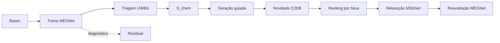

# Figura 16 - Atualização de resumo_procedimento.png

## Status

Atualizar figura existente.

## Diretrizes visuais

- Reduzir o texto dentro da figura ao mínimo necessário; detalhes devem ir na legenda ou no texto do TCC.
- Não usar emojis. Se precisar de marcação visual, usar ícones simples, setas, cores ou símbolos científicos.
- Não criar blocos finais de resumo, checklist ou explicações longas dentro da figura.
- Priorizar leitura rápida: poucas etapas, rótulos curtos, boa hierarquia visual e espaçamento amplo.

## Regra de conteúdo do prompt

- Este markdown deve conter toda a informação necessária para criar a figura corretamente.
- Nem toda informação deste markdown deve virar texto dentro da figura; a imagem deve mostrar a informação por composição visual, rótulos curtos, números essenciais e legenda.
- Quando houver muitos detalhes, separar: o que aparece como desenho, o que aparece como rótulo curto, o que aparece como número e o que deve ficar somente na legenda ou no texto do TCC.

## Arquivos atuais

- `final/figures/procedimento.png`
- `tcc-text/figures/resumo_procedimento.png`

## Diagnóstico da versão atual

A figura atual descreve bem o pipeline completo, mas precisa de ajuste conceitual importante: a correção residual aparece como parte central do fluxo de predição e reavaliação. Nos resultados finais, ela deve ser tratada como experimento auxiliar de calibração/diagnóstico, não como etapa obrigatória do pipeline final.

## Objetivo da atualização

Criar um fluxograma metodológico final, limpo e fiel ao que foi efetivamente usado para gerar os resultados finais.

## Layout recomendado

Usar um fluxograma vertical ou horizontal com oito blocos principais:

1. Bases de dados.
2. Treino do modelo MEGNet.
3. Triagem UWBG no C2DB.
4. Aprendizado químico e `S_chem`.
5. Geração guiada por substituições.
6. Checagem de novidade contra C2DB.
7. Ranking e seleção por faixa de gap.
8. Relaxação M3GNet e reavaliação MEGNet.

Adicionar a correção residual como uma caixa lateral:

`Correção residual: análise auxiliar de viés/calibração`

Essa caixa lateral não deve estar no caminho principal.

## Diagrama base

O bloco `Residual` deve ser lateral e menor. A figura não deve terminar com uma caixa de resumo; a saída pode ser apenas `candidatos priorizados`.

## Elementos visuais obrigatórios

- Fluxo principal com setas claras.
- C2DB e Materials Project como entradas.
- MEGNet com alvo `bandgap HSE`.
- Filtro `Eg >= 3.4 eV`.
- `S_chem` e `substitution_risk`.
- Novidade por `fórmula reduzida + layergroup`.
- M3GNet como relaxador estrutural.
- MEGNet reaplicado após relaxação.

## Correções específicas

- Substituir qualquer texto do tipo `MEGNet + residual` no caminho principal por `MEGNet fine-tune` ou `MEGNet gap model`.
- Remover qualquer ambiguidade de "C2DDB"; usar sempre `C2DB`.
- Garantir que o limiar UWBG seja `3.4 eV`.
- Não usar limiar anterior incorreto em nenhum ponto.
- Indicar que DFT externo com LiF/BaF2 foi comparação posterior, não treino.

## Números principais a manter

- `9627` materiais avaliados.
- `1529` candidatos UWBG na triagem.
- `697` candidatos gerados.
- `78.9%` UWBG predito na geração guiada.
- `323` novas composições.
- `90/90` estruturas relaxadas.
- `74/90` ainda UWBG após relaxação.
- `50/61` novas composições ainda UWBG após relaxação.
