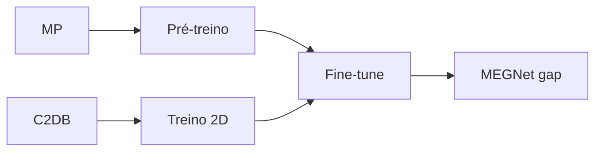

# Figura 17 - Atualização de resumo_dados_treinamento.png

## Status

Atualizar figura existente.

## Diretrizes visuais

- Reduzir o texto dentro da figura ao mínimo necessário; detalhes devem ir na legenda ou no texto do TCC.
- Não usar emojis. Se precisar de marcação visual, usar ícones simples, setas, cores ou símbolos científicos.
- Não criar blocos finais de resumo, checklist ou explicações longas dentro da figura.
- Priorizar leitura rápida: poucas etapas, rótulos curtos, boa hierarquia visual e espaçamento amplo.

## Regra de conteúdo do prompt

- Este markdown deve conter toda a informação necessária para criar a figura corretamente.
- Nem toda informação deste markdown deve virar texto dentro da figura; a imagem deve mostrar a informação por composição visual, rótulos curtos, números essenciais e legenda.
- Quando houver muitos detalhes, separar: o que aparece como desenho, o que aparece como rótulo curto, o que aparece como número e o que deve ficar somente na legenda ou no texto do TCC.

## Arquivos atuais

- `final/figures/dados_e_treinamento.png`
- `tcc-text/figures/resumo_dados_treinamento.png`

## Diagnóstico da versão atual

A figura atual está bem estruturada, mas precisa deixar mais claro quais resultados pertencem ao pré-treino, ao treino em C2DB e ao modelo efetivamente usado nos resultados finais. A caixa de "uso do modelo" também deve retirar a correção residual como etapa central.

## Objetivo da atualização

Apresentar dados, representação e treinamento do modelo de bandgap de modo reprodutível e coerente com os resultados finais.

## Layout recomendado

Manter quatro colunas:

1. Fontes de dados.
2. Representação dos materiais.
3. Treinamento dos modelos.
4. Modelo preditivo final.

Adicionar uma faixa inferior com métricas e quantidades principais.

## Diagrama base

A faixa inferior deve conter poucas métricas, preferencialmente `MAE` principal e tamanho aproximado dos dados. Métricas completas podem ficar em tabela no texto.

## Conteúdo obrigatório

Fontes de dados:

- Materials Project como base 3D de pré-treino.
- C2DB como base principal 2D.
- Indicar que o alvo final é `bandgap HSE`.

Representação:

- Estrutura cristalina -> grafo.
- Átomos como nós.
- Vizinhanças como arestas.
- Distâncias como atributos de aresta.

Treinamento:

- Pré-treino em Materials Project.
- Treino do zero em C2DB.
- Fine-tune MP -> C2DB.
- Separação treino/validação/teste.

Modelo final:

- MEGNet para predição de `Eg HSE`.
- Usado antes e depois da relaxação.

## Métricas a incluir

Confirmar com as tabelas finais antes do desenho, mas a figura deve conter:

- Pré-treino MP: `val_MAE = 0.3259 eV`, `test_MAE = 0.3574 eV`.
- Scratch C2DB: `test_MAE = 0.3038 eV`.
- Fine-tune MP -> C2DB: `test_MAE = 0.3243 eV`.

Se houver espaço, incluir RMSE em uma tabela pequena ou mover RMSE para a legenda.

## Correção importante

A figura atual lista "correção residual" como uso do modelo. Atualizar para:

- Triagem de materiais.
- Geração guiada.
- Predição antes da relaxação.
- Predição pós-relaxação.

Se residual for citado, usar caixa separada:

`Correção residual: experimento auxiliar de calibração, não usado como filtro principal final.`

## Cuidados

- Não sugerir que o modelo fine-tune foi escolhido por menor MAE global se a escolha foi motivada por comportamento na faixa UWBG.
- Não misturar PBE e HSE como alvo final.
- Manter a distinção entre base 3D MP e base 2D C2DB.
