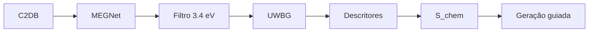

# Figura 18 - Atualização de resumo_triagem.png

## Status

Atualizar figura existente.

## Diretrizes visuais

- Reduzir o texto dentro da figura ao mínimo necessário; detalhes devem ir na legenda ou no texto do TCC.
- Não usar emojis. Se precisar de marcação visual, usar ícones simples, setas, cores ou símbolos científicos.
- Não criar blocos finais de resumo, checklist ou explicações longas dentro da figura.
- Priorizar leitura rápida: poucas etapas, rótulos curtos, boa hierarquia visual e espaçamento amplo.

## Regra de conteúdo do prompt

- Este markdown deve conter toda a informação necessária para criar a figura corretamente.
- Nem toda informação deste markdown deve virar texto dentro da figura; a imagem deve mostrar a informação por composição visual, rótulos curtos, números essenciais e legenda.
- Quando houver muitos detalhes, separar: o que aparece como desenho, o que aparece como rótulo curto, o que aparece como número e o que deve ficar somente na legenda ou no texto do TCC.

## Arquivos atuais

- `final/figures/triagem.png`
- `tcc-text/figures/resumo_triagem.png`

## Diagnóstico da versão atual

A figura atual está alinhada com o limiar `3.4 eV` e com o uso do MEGNet fine-tune. Ela já comunica bem a triagem, o aprendizado químico e as tendências elementares. A principal melhoria necessária é reduzir densidade visual e reforçar que `S_chem` é critério de priorização, não garantia física.

## Objetivo da atualização

Mostrar a triagem inicial de materiais do C2DB e a derivação do score químico usado para guiar substituições.

## Layout recomendado

Manter fluxo em duas linhas:

Linha superior:

`C2DB -> MEGNet -> filtro UWBG -> distribuição de Eg`

Linha inferior:

`candidatos UWBG -> descritores químicos -> classificadores -> S_chem -> tendências químicas`

## Diagrama base



O histograma deve ser o único gráfico quantitativo grande. As tendências químicas devem aparecer como pequenos marcadores, não como explicações completas.

## Conteúdo obrigatório

- `9627` materiais avaliados.
- Modelo `MEGNet fine-tune MP -> C2DB`.
- Filtro:

```tex
E_g^{pred} \geq 3.4~\mathrm{eV}
```

- `1529` candidatos UWBG.
- Distribuição de bandgap predito com linha vertical em `3.4 eV`.
- Descritores químicos:
  - composição.
  - frações atômicas.
  - eletronegatividade.
  - raios.
  - energia de ligação média, se usada.
- Classificadores RF/LR.
- Score químico `S_chem`.
- Tendências:
  - favoráveis: `F`, `H`, `O`.
  - desfavoráveis: `S`, `Se`, `Te`.

## Correções e melhorias

- Garantir que o histograma não sugira que todos os candidatos acima de `3.4 eV` são novos materiais.
- Adicionar um rótulo: `triagem de materiais conhecidos + candidatos para aprendizado`.
- Explicar visualmente que `S_chem` guia a geração posterior.
- Remover excesso de listas internas se o texto ficar pequeno.

## Cuidados

- Não usar `S_chem` como prova de estabilidade.
- Não confundir triagem C2DB com geração de novas composições.
- Não usar limiar anterior incorreto.
