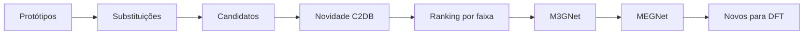

# Figura 19 - Atualização de resumo_geracao_validacao.png

## Status

Atualizar figura existente.

## Diretrizes visuais

- Reduzir o texto dentro da figura ao mínimo necessário; detalhes devem ir na legenda ou no texto do TCC.
- Não usar emojis. Se precisar de marcação visual, usar ícones simples, setas, cores ou símbolos científicos.
- Não criar blocos finais de resumo, checklist ou explicações longas dentro da figura.
- Priorizar leitura rápida: poucas etapas, rótulos curtos, boa hierarquia visual e espaçamento amplo.

## Regra de conteúdo do prompt

- Este markdown deve conter toda a informação necessária para criar a figura corretamente.
- Nem toda informação deste markdown deve virar texto dentro da figura; a imagem deve mostrar a informação por composição visual, rótulos curtos, números essenciais e legenda.
- Quando houver muitos detalhes, separar: o que aparece como desenho, o que aparece como rótulo curto, o que aparece como número e o que deve ficar somente na legenda ou no texto do TCC.

## Arquivos atuais

- `final/figures/geracao_guiada_e_validacao.png`
- `tcc-text/figures/resumo_geracao_validacao.png`

## Diagnóstico da versão atual

A figura atual é a mais próxima da metodologia final. Ela já mostra geração guiada, checagem de novidade, ranking, seleção por faixa, relaxação M3GNet e reavaliação MEGNet. A atualização deve melhorar legibilidade e incluir de forma mais explícita a distinção entre candidatos conhecidos e novos.

## Objetivo da atualização

Documentar o pipeline final de geração e validação dos candidatos, incluindo quais resultados são controles, diagnósticos e novas composições.

## Layout recomendado

Usar uma sequência principal numerada:

1. Protótipos 2D do C2DB.
2. Substituições guiadas por `S_chem`.
3. Candidatos gerados.
4. Checagem de novidade contra C2DB.
5. Ranking e seleção por faixa de gap.
6. Relaxação M3GNet.
7. Reavaliação MEGNet.
8. Saída: candidatos novos priorizados para DFT.

O fluxo pode ser em "S" como na versão atual, mas com menos texto por bloco.

## Diagrama base

O fluxo deve privilegiar setas e números. Evitar blocos finais de "critérios aplicados" ou "modelos utilizados"; esses detalhes pertencem à legenda ou ao texto.

## Conteúdo obrigatório

- `697` candidatos gerados.
- `78.9%` UWBG predito.
- Novidade:
  - `297 known_material`.
  - `77 known_composition_new_layergroup`.
  - `323 new_composition`.
- Arquivo/tabela de saída: `top_novel_candidates.csv`, se esse for o arquivo final usado.
- Seleção por faixas de gap.
- Relaxação:
  - M3GNet PES.
  - `relax_cell=False`.
  - `90/90` estruturas relaxadas.
- Reavaliação:
  - MEGNet fine-tune.
  - `74/90` ainda UWBG.
  - `50/61` novas composições ainda UWBG.

## Elementos visuais obrigatórios

- Três classes de novidade com cores diferentes:
  - Cinza/azul: material já conhecido.
  - Amarelo: composição conhecida em novo layergroup.
  - Verde: nova composição.
- Funil de candidatos.
- Mini histograma ou régua por faixas de gap.
- Bloco M3GNet separado do bloco MEGNet.
- Caixa final com candidatos novos priorizados.

## Correções e melhorias

- Reforçar que materiais já existentes ainda são úteis como controle/validação, mas não entram na tabela principal de candidatos novos.
- Indicar que LiF e BaF2 foram casos de comparação DFT externa, não dados de treino.
- Evitar que a figura pareça afirmar que todos os `697` candidatos são novas composições.
- Se incluir taxa baseline, separar claramente:
  - geração guiada: `697`, `78.9%`.
  - baseline aleatório: incluir apenas se houver espaço e se for discutido no texto.

## Cuidados

- Não colocar correção residual no caminho principal.
- Não omitir a checagem contra C2DB.
- Não usar somente ranking por maior gap; a seleção por faixa é importante para as conclusões.
