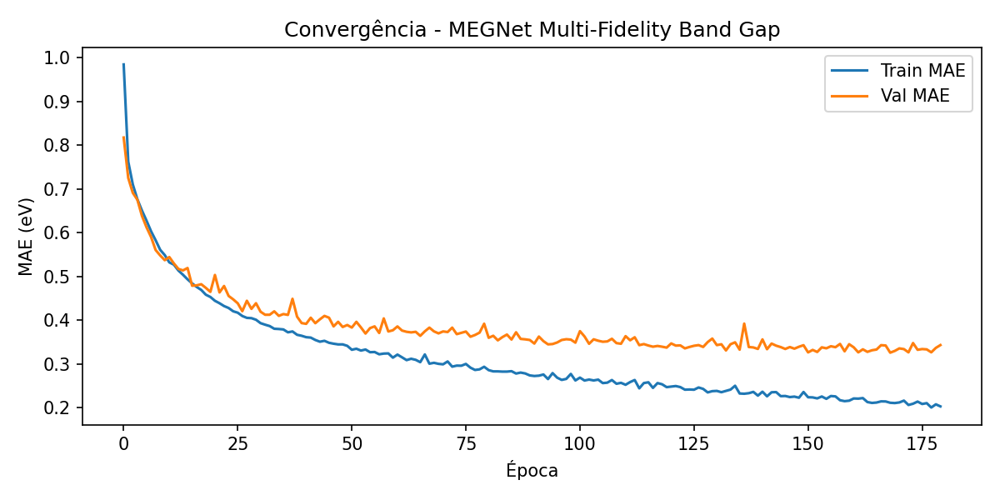

# Experimento 000 - Pre-treino MEGNet em MP

## Objetivo
Pre-treinar o MEGNet em dados Materials Project locais para gerar um checkpoint base usado no fine-tuning C2DB. Esta execucao foi refeita do zero apos limpar `final/runs`.

## Configuracao
- Kernel/env: `matgl-tcc`.
- Dados: `final/data/mp.2019.04.01.json`.
- Saida: `final/runs/000_megnet_pretrain_mp`.
- Treino: `MAX_EPOCHS=180`, `PATIENCE=30`, `BATCH_SIZE=64`, `FORCE_RETRAIN=True`.
- Checkpoint: `best-epoch=168-val_MAE=0.3259.ckpt`.

## Resultados
- Epocas avaliadas: 180.
- Melhor epoca de validacao: 168.
- Melhor `val_MAE`: 0.3259 eV.
- `test_MAE`: 0.3574 eV.
- `test_RMSE`: 0.6189 eV.
- Amostra de predicoes: `outputs/sample_predictions.csv` (5 linhas x 6 colunas).

## Interpretacao
O pre-treino convergiu sem estouro de memoria e forneceu um checkpoint local em `final/runs`. A metrica de teste (~0.3574 eV) e adequada como inicializacao, mas o fine-tuning C2DB ainda deve ser comparado contra treino scratch porque o dominio 2D e os gaps HSE diferem do MP.

## Figuras
- 
