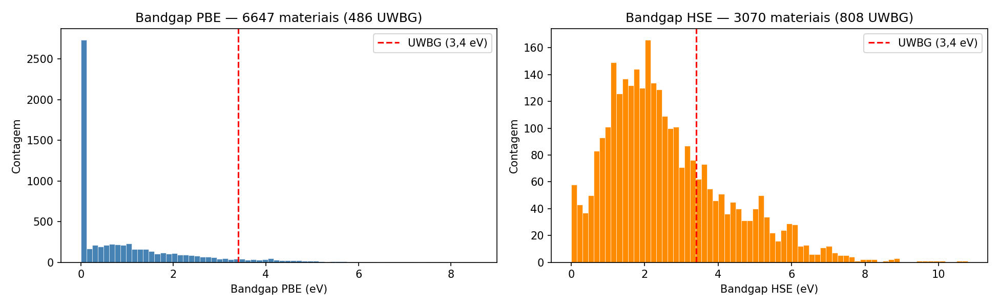
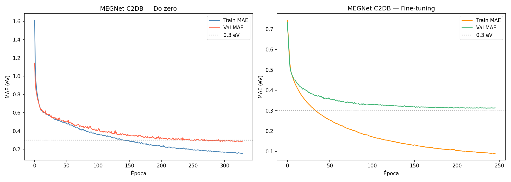
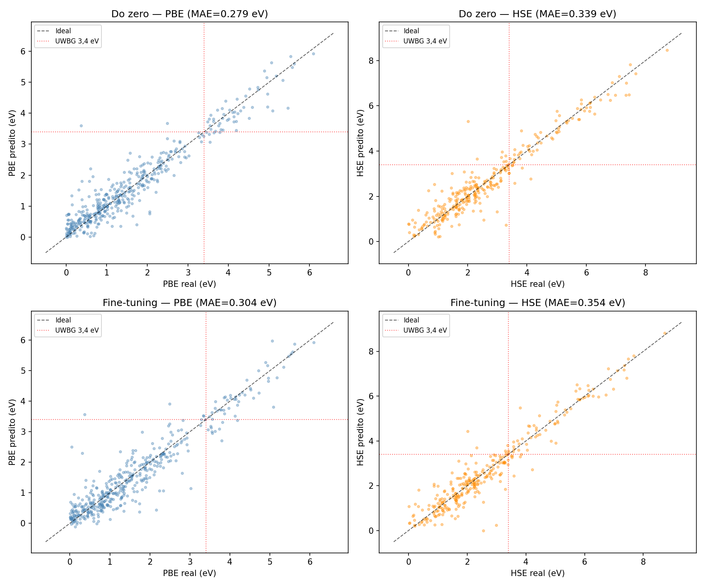
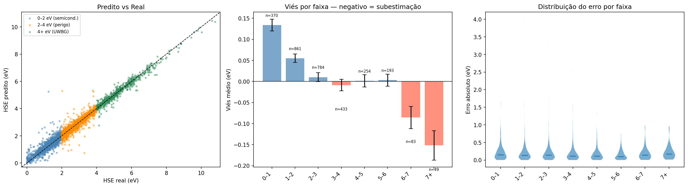
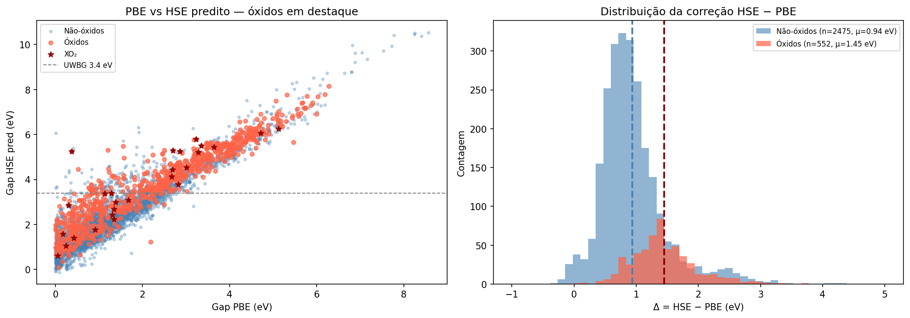
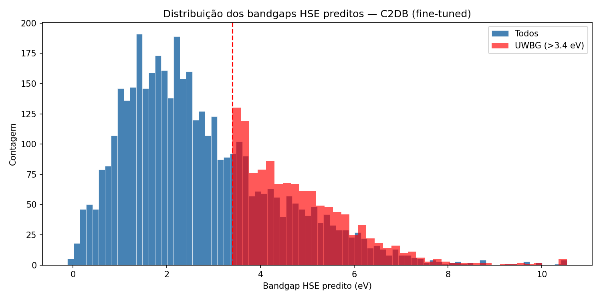
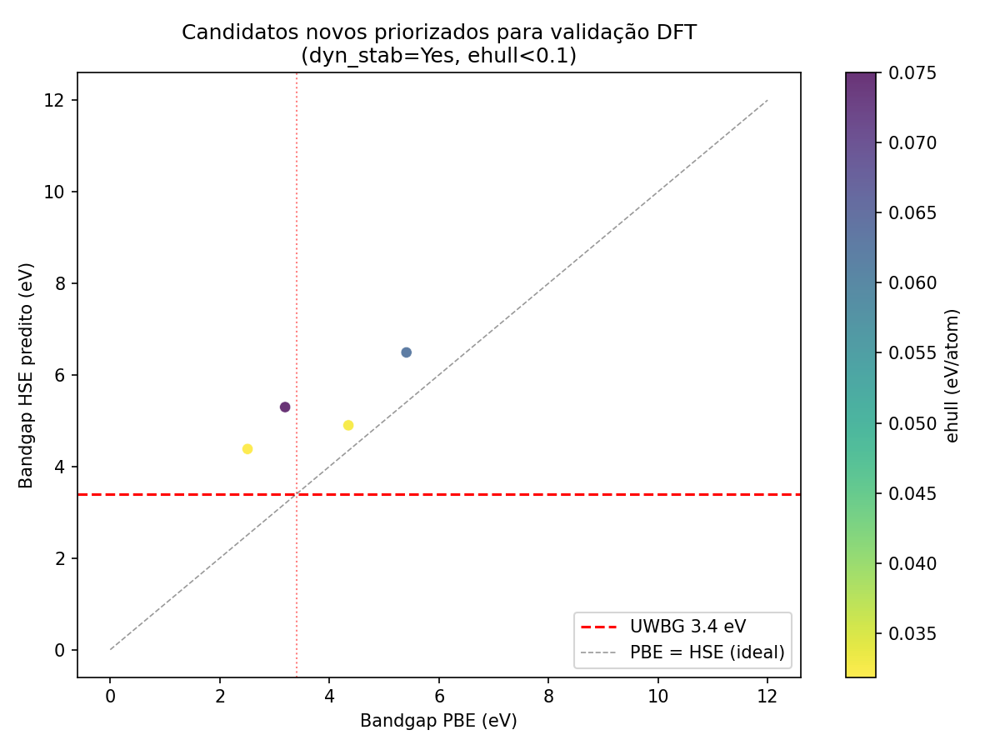
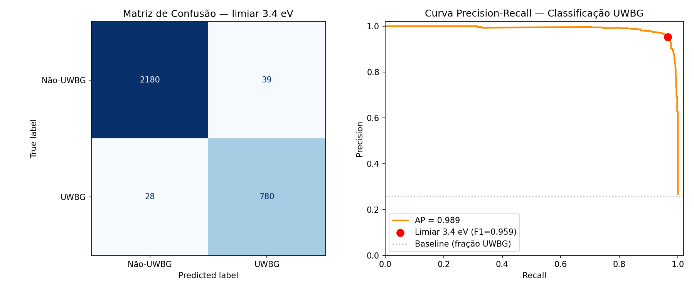

# Experimento 001 - MEGNet C2DB: scratch vs fine-tune

## Objetivo
Treinar MEGNet no C2DB e comparar treinamento do zero contra fine-tuning a partir do checkpoint MP gerado no experimento 000.

## Configuracao
- Dados: `final/data/raw/c2db.db`.
- Saida: `final/runs/001_megnet_finetune_c2db`.
- `FORCE_RETRAIN=True`, `MAX_EPOCHS=360`, `PATIENCE_SCRATCH=35`, `PATIENCE_FINETUNE=35`.
- `USE_JARVIS=False` para evitar download externo e manter a pasta `final` autocontida.
- `USE_WANDB=False`; logs locais em CSV.

## Resultados
| Modelo | Epocas | Melhor val_MAE | Test MAE | Test RMSE | Checkpoint |
|---|---:|---:|---:|---:|---|
| Scratch | 329 | 0.2822 | 0.3038 | 0.4410 | `model/scratch/best-epoch=293-val_MAE=0.2822.ckpt` |
| Fine-tune MP | 246 | 0.3120 | 0.3243 | 0.4725 | `model/finetune/best-epoch=235-val_MAE=0.3120.ckpt` |

- Candidatos UWBG preditos: `outputs/uwbg_candidates.csv` (4214 linhas x 7 colunas).
- Novos candidatos priorizados para DFT: `outputs/uwbg_new_candidates_for_dft.csv` (4 linhas x 9 colunas).
- Top candidatos novos: 2CaCl2-1, 2SeAs2O6-1, 8BeI2-1, 2TlF3-2.

## Interpretacao
Nesta execucao autocontida, o modelo treinado do zero em C2DB superou o fine-tuning do checkpoint MP em validacao e teste. Isso sugere que a transferencia MP -> C2DB nao foi benefica com os parametros atuais e sem JARVIS, possivelmente por diferenca de dominio e de distribuicao dos targets. Para screening conservador, os relatorios posteriores usam os dois modelos quando relevante e destacam as diferencas.

## Figuras
- 
- 
- 
- 
- 
- 
- 
- 
