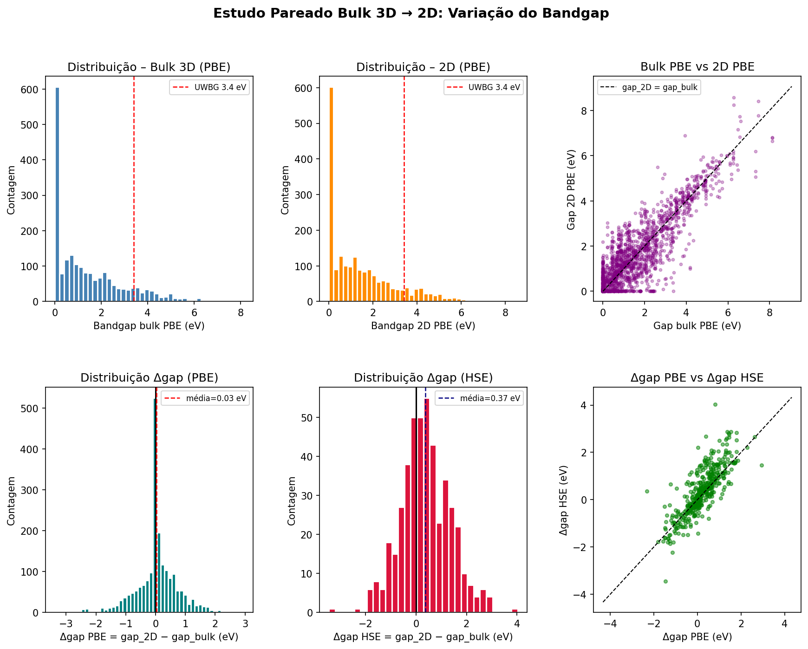
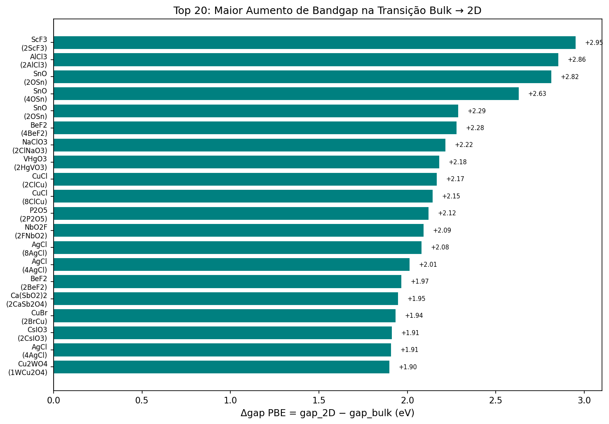

# Experimento 002 - Analise pareada bulk-2D

## Objetivo
Relacionar materiais 2D do C2DB com analogos bulk do MP e medir diferencas de gap entre dominios.

## Resultados
- Pares totais bulk-2D: 2046.
- Pares com PBE: 2027.
- Pares com HSE: 456.
- Arquivos: `outputs/paired_bulk2d.csv`, `outputs/paired_pbe.csv`, `outputs/paired_hse.csv`.

## Interpretacao
A analise confirma que existe cobertura suficiente para estudar transferencia entre bulk e 2D, mas a cobertura HSE pareada e menor que a PBE. Isso justifica tratar o gap de dominio explicitamente no experimento 003 em vez de assumir que o pre-treino MP transfere diretamente.

## Figuras
- 
- 
