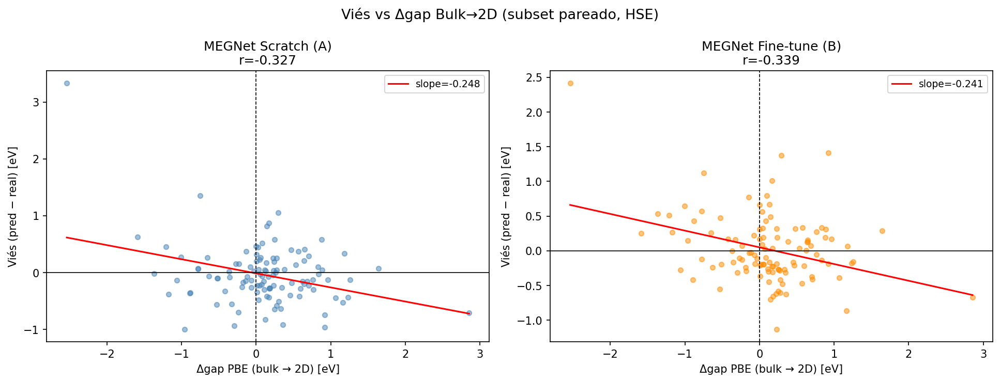
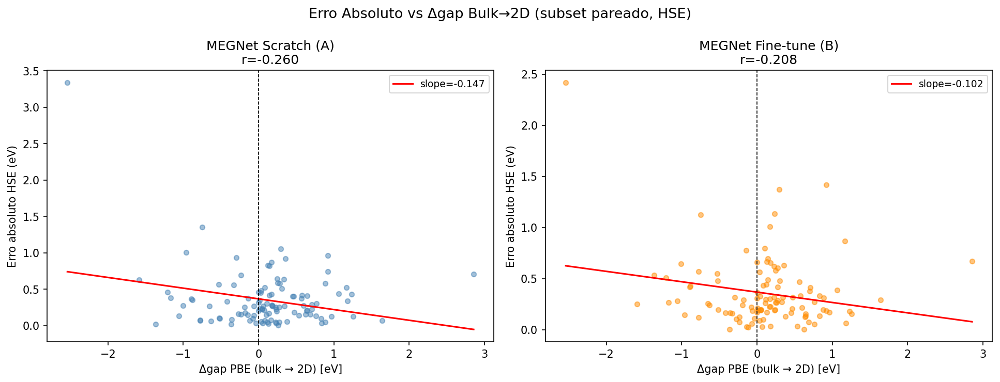
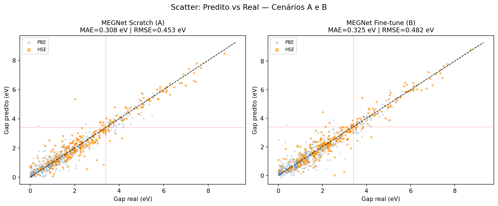

# Experimento 003 - Gap de dominio MEGNet

## Objetivo
Comparar erros dos modelos scratch e fine-tune nos materiais com informacao suficiente para avaliar efeito de dominio.

## Resultados
| model | MAE | RMSE | Bias | MAE_HSE | MAE_UWBG | Bias_UWBG | n | n_UWBG |
| --- | --- | --- | --- | --- | --- | --- | --- | --- |
| MEGNet Scratch (A) | 0.3077 | 0.4532 | 0.0002 | 0.3456 | 0.3074 | -0.1099 | 729 | 125 |
| MEGNet Fine-tune (B) | 0.3247 | 0.4820 | -0.0066 | 0.3565 | 0.3133 | -0.0743 | 729 | 125 |

## Interpretacao
O scratch teve menor MAE global (0.3077 eV) que o fine-tune (0.3247 eV). Em UWBG, o fine-tune reduziu o vies negativo, mas nao reduziu MAE. Isso reforca a conclusao do experimento 001: a inicializacao MP nao dominou o treino C2DB local nesta configuracao.

## Figuras
- 
- 
- 
