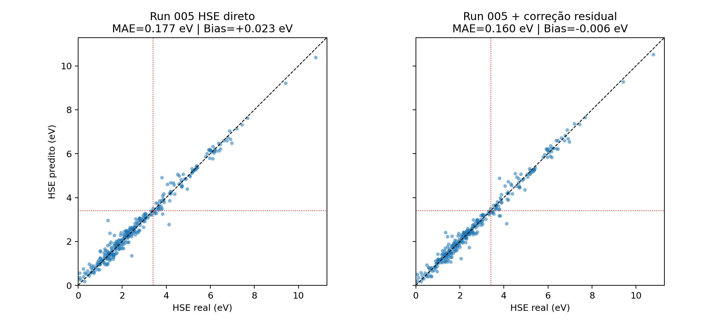
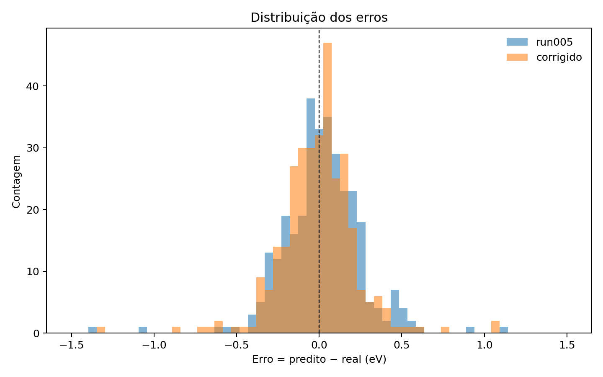
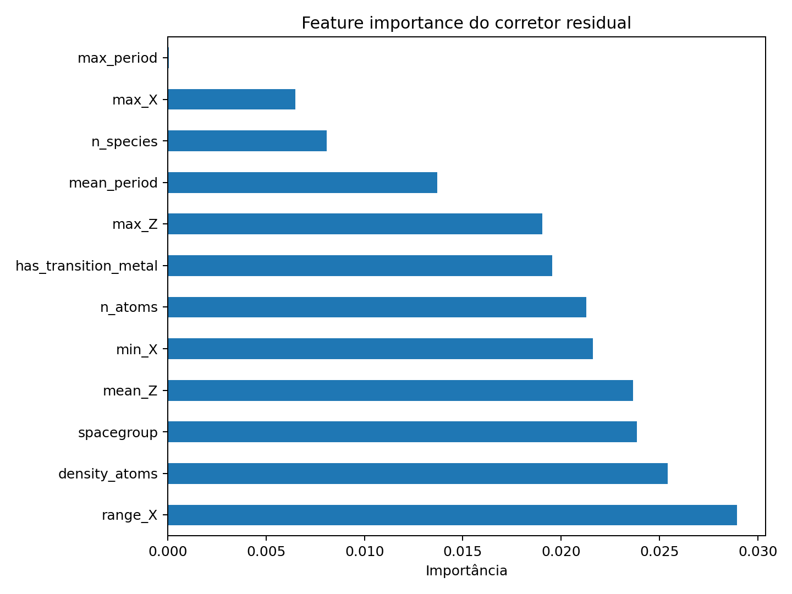
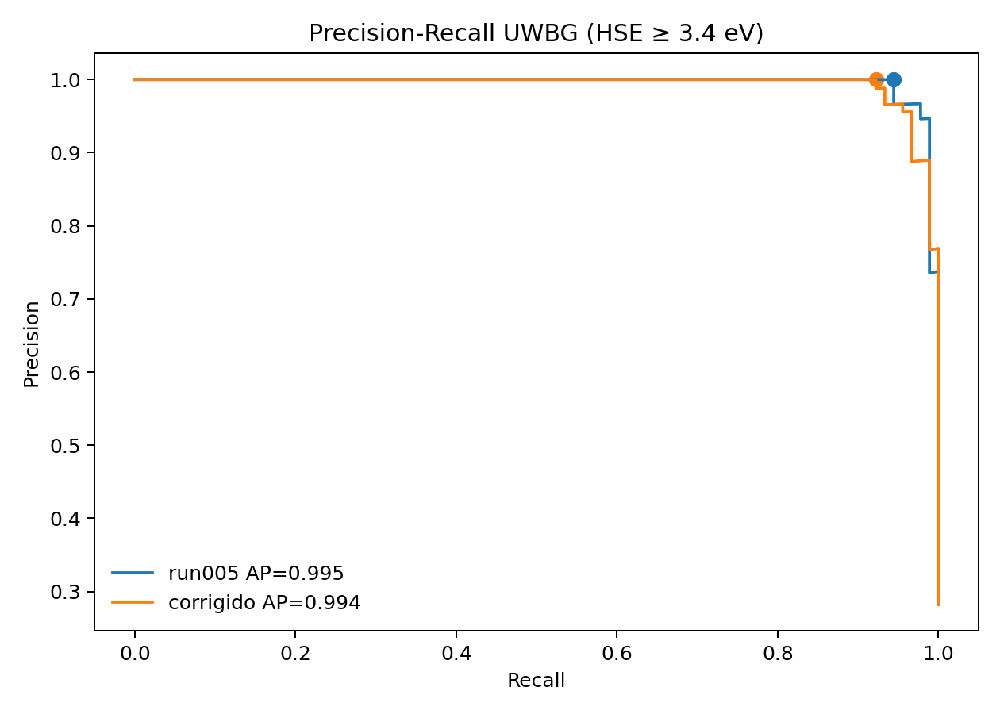

# Experimento 004 - Correcao residual

## Objetivo
Aprender o residuo entre predicao MEGNet e HSE verdadeiro usando descritores quimicos/estruturais tabulares, reduzindo erro continuo sem retreinar o GNN.

## Resultados
- Test MAE baseline run005: 0.1767 eV.
- Test MAE corrigido: 0.1601 eV.
- Reducao relativa de MAE no teste: 9.4%.
- Test bias baseline: 0.0235 eV.
- Test bias corrigido: -0.0065 eV.

Classificacao UWBG (`threshold=3.4 eV`):
| modelo | threshold | TP | FP | FN | TN | precision | recall | f1 | AP |
| --- | --- | --- | --- | --- | --- | --- | --- | --- | --- |
| run005 | 3.4000 | 85 | 0 | 5 | 229 | 1.0000 | 0.9444 | 0.9714 | 0.9954 |
| corrigido | 3.4000 | 83 | 0 | 7 | 229 | 1.0000 | 0.9222 | 0.9595 | 0.9936 |

## Interpretacao
A correcao residual reduziu MAE e bias no teste, mas diminuiu levemente o recall UWBG (0.9444 -> 0.9222). Assim, a correcao e util para calibracao numerica, enquanto o screening UWBG deve manter atencao a falsos negativos quando o objetivo for descoberta.

## Figuras
- 
- 
- 
- 
