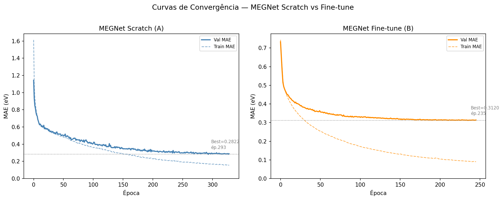
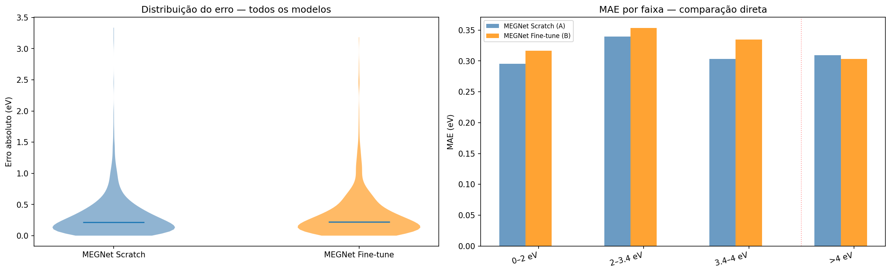
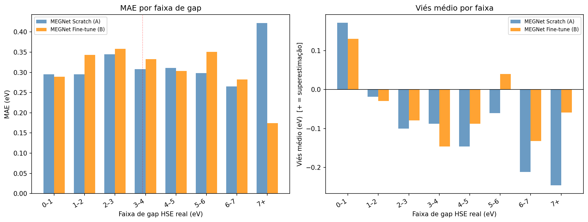
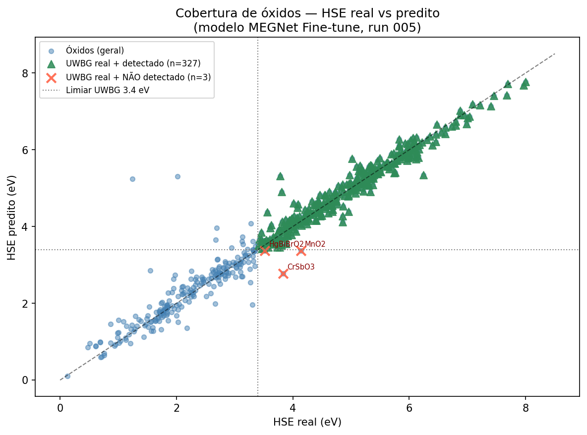
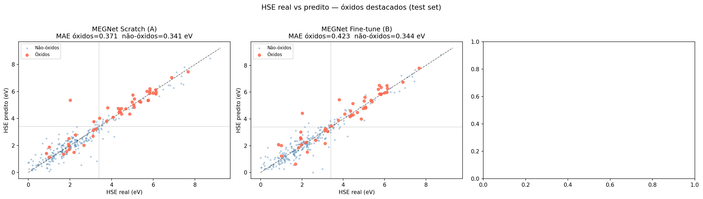
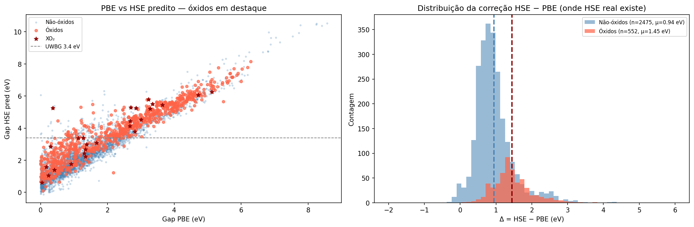
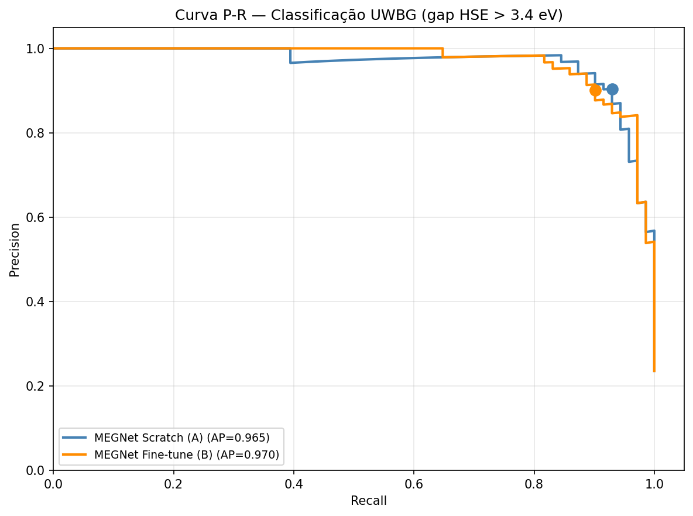
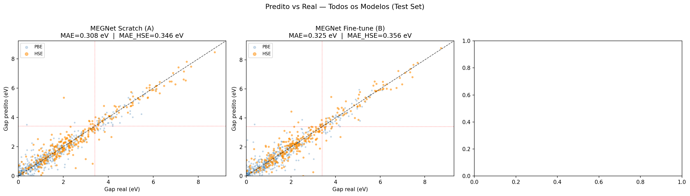
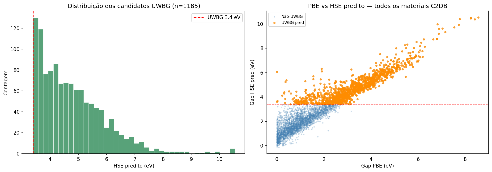

# Experimento 005 - Inferencia e screening C2DB

## Objetivo
Aplicar os modelos MEGNet treinados a todos os materiais C2DB disponiveis e organizar o screening UWBG.

## Resultados
- Materiais avaliados: 9627.
- Materiais com HSE conhecido: 3070.
- Candidatos `UWBG_FT` por fine-tune: 1529.
- Categorias mais frequentes: {'haleto': 2911, 'sulfeto': 1164, 'tiossal': 1141, 'seleneto': 1138, 'telureto': 1110}.
- Arquivo principal: `outputs/all_materials_predictions.csv`.

## Interpretacao
O screening cobre 9.627 materiais e separa predicoes scratch/fine-tune. A distribuicao e dominada por haletos, sulfetos e selenetos, com candidatos UWBG fortemente concentrados em quimicas com alta eletronegatividade, em linha com os filtros aprendidos no experimento 006.

## Figuras
- 
- 
- 
- 
- 
- 
- 
- 
- 
