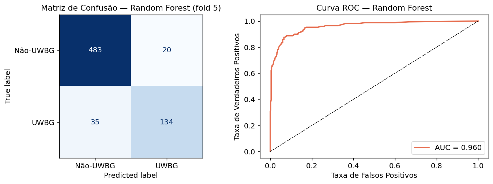
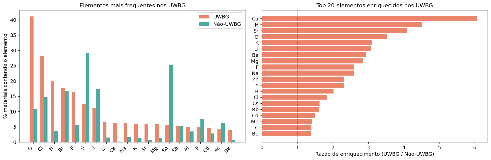
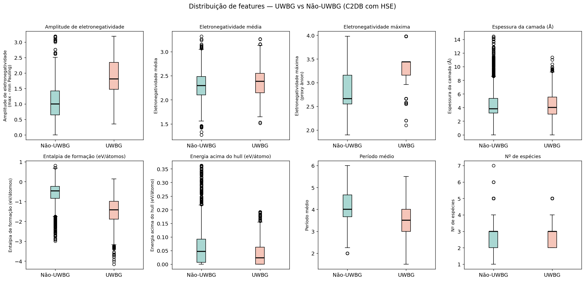
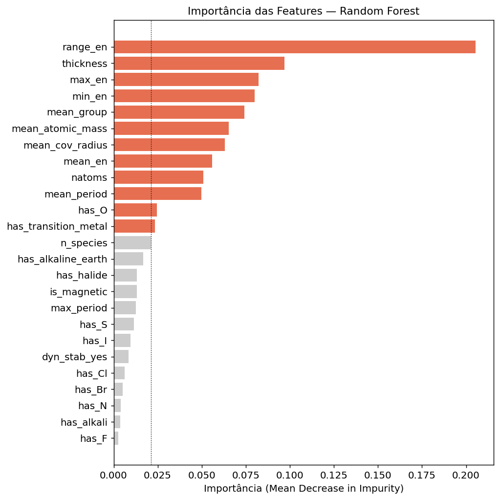
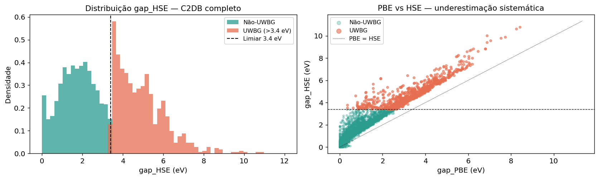
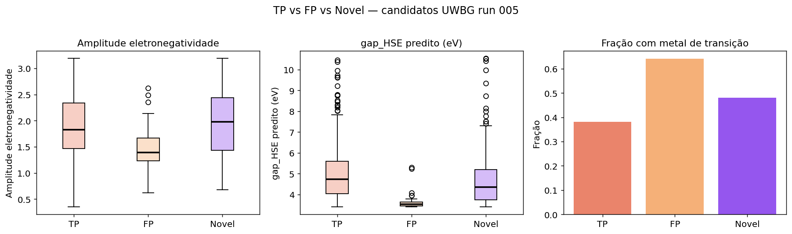

# Experimento 006 - Caracterizacao UWBG

## Objetivo
Caracterizar quimicamente candidatos UWBG, separar TP/FP/Novel e treinar classificadores tabulares para guiar geracao.

## Resultados
- Candidatos classificados: 1185.
- Classes: {'TP': 780, 'Novel': 366, 'FP': 39}.
- Novos candidatos ranqueados: 366.
- Elementos favoraveis exportados: ['F', 'H', 'O'].
- Elementos desfavoraveis exportados: ['S', 'Se', 'Te'].
- Filtros/export: `outputs/chemical_filters.json`, `outputs/rf_classifier.joblib`, `outputs/lr_classifier.joblib`.

## Interpretacao
A assinatura UWBG aprendida favorece F/O/H e penaliza calcogenetos pesados. O conjunto Novel e grande o suficiente para alimentar geracao guiada, mas a validacao final ainda depende de DFT, especialmente para estruturas com `dyn_stab` desconhecido ou `ehull` maior.

## Figuras
- 
- 
- 
- 
- 
- 
