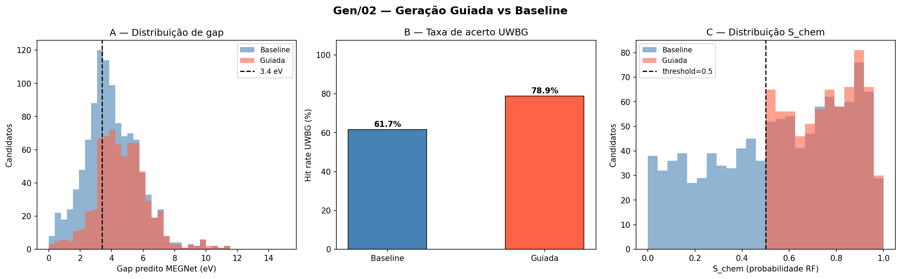

# Experimento 007 - Geracao guiada com novidade C2DB e relaxacao M3GNet

## Objetivo
Gerar candidatos UWBG por substituicao em prototipos C2DB, manter materiais conhecidos como controles de validacao e separar a tabela de descoberta em composicoes realmente novas. A rodada atual tambem relaxa candidatos selecionados com M3GNet antes de recalcular o gap com o MEGNet treinado.

## Implementacao atual
- O indice `outputs/c2db_material_index.csv` compara formula reduzida e layergroup contra o C2DB.
- `novelty_class` separa `known_material`, `known_composition_new_layergroup` e `new_composition`.
- `top_novel_candidates.csv` contem somente `new_composition`.
- Candidatos conhecidos permanecem em `gap_bin_samples_all.csv` para validacao/calibracao.
- O MEGNet de gap usa o `matgl` do conda `matgl-tcc`, isto e, o mesmo ambiente do treino.
- A relaxacao M3GNet roda em subprocesso via `08_guided_generation/relax_m3gnet_batch.py`, usando `final/vendor/matgl_src` e o modelo local `final/models/M3GNet-PES-MatPES-PBE-2025.2`.
- `relax_cell=False` preserva a celula/vacuo 2D; a relaxacao altera posicoes atomicas.

## Resultados gerais
- Candidatos baseline: 1083; taxa UWBG predita: 61.7%.
- Candidatos guiados: 697; taxa UWBG predita: 78.9%.
- Guiados `new_composition`: 323.
- Guiados `known_material`: 297.
- Guiados `known_composition_new_layergroup`: 77.
- Top candidatos finais: 50, todos `new_composition`.
- Distribuicao guiada por faixa de gap nao relaxado: {'0-2': 34, '10-12': 7, '2-4': 225, '4-6': 320, '6-8': 93, '8-10': 15}.
- Relaxacao M3GNet: {'relaxed': 90}.
- Deltas pos-relaxacao: media -0.801 eV, mediana -0.600 eV, minimo -5.572 eV, maximo 3.345 eV.
- Casos relaxados ainda UWBG (`gap_pred_relaxed >= 3.4 eV`): 74/90.
- Casos novos relaxados ainda UWBG: 50/61.
- Distribuicao dos gaps relaxados: {'0-2': 5, '2-4': 22, '4-6': 26, '6-8': 19, '8-10': 14, '10-12': 4, '>12': 0}.

## Interpretacao da relaxacao
A relaxacao reduziu o gap predito na media, mas nao de forma uniforme. Isso confirma que o ranking baseado apenas no prototipo substituido pode superestimar candidatos, principalmente quando `substitution_risk=high`. Ainda assim, 50 de 61 composicoes novas relaxadas permaneceram acima de 3.4 eV, entao a geracao continua produzindo um conjunto util de candidatos UWBG, agora com triagem mais conservadora.

### Top composicoes novas por gap relaxado
| formula | proto_formula | proto_layergroup | substitution | gap_pred_unrelaxed | gap_pred_relaxed | gap_pred_relax_delta | s_chem_rf | m3gnet_energy_pa_relaxed |
| --- | --- | --- | --- | --- | --- | --- | --- | --- |
| BeB2F8 | MgB2F8 | p-3m1 | Mg→Be | 10.687 | 10.858 | 0.171 | 0.830 | -5.599 |
| MgAl2F8 | MgB2F8 | p-3m1 | B→Al | 9.775 | 10.631 | 0.856 | 0.865 | -5.269 |
| BF3 | AlF3 | p-31m | Al→B | 11.405 | 10.122 | -1.283 | 0.580 | -5.750 |
| BaB2F8 | MgB2F8 | p-3m1 | Mg→Ba | 10.039 | 9.750 | -0.289 | 0.885 | -5.824 |
| BOF | GaOF | pmmn | Ga→B | 8.913 | 9.502 | 0.590 | 0.505 | -6.917 |
| NaSrF3 | NaSrI3 | p-31m | I→F | 9.174 | 9.431 | 0.257 | 0.930 | -4.579 |
| LiMgF3 | LiMgBr3 | p-31m | Br→F | 9.694 | 9.392 | -0.302 | 0.955 | -4.555 |
| CaB2F8 | MgB2F8 | p-3m1 | Mg→Ca | 10.521 | 9.372 | -1.149 | 0.935 | -5.682 |
| NaCaF3 | NaCaI3 | p-31m | I→F | 9.788 | 9.054 | -0.734 | 0.915 | -4.667 |
| ZrZnF6 | HfZnF6 | p312 | Hf→Zr | 8.253 | 7.728 | -0.525 | 0.685 | -5.217 |
| BClO | GaClO | pmmn | Ga→B | 7.033 | 7.727 | 0.694 | 0.515 | -6.052 |
| SrB2F8 | MgB2F8 | p-3m1 | Mg→Sr | 10.266 | 7.668 | -2.598 | 0.925 | -5.618 |
| Sr(BH4)2 | Mg(BH4)2 | p-3m1 | Mg→Sr | 7.190 | 7.248 | 0.058 | 0.565 | -4.025 |
| NaCaCl3 | NaCaI3 | p-31m | I→Cl | 7.668 | 7.065 | -0.603 | 0.825 | -3.546 |
| Ca(BH4)2 | Mg(BH4)2 | p-3m1 | Mg→Ca | 7.170 | 6.978 | -0.191 | 0.510 | -4.072 |
| LiCaCl3 | LiMgCl3 | p-31m | Mg→Ca | 7.208 | 6.875 | -0.334 | 0.855 | -3.543 |
| Be(BH4)2 | Mg(BH4)2 | p-3m1 | Mg→Be | 8.437 | 6.731 | -1.705 | 0.615 | -4.071 |
| BeClF | CaClF | p4/nmm | Ca→Be | 7.756 | 6.610 | -1.146 | 0.840 | -4.533 |
| Ba(BH4)2 | Mg(BH4)2 | p-3m1 | Mg→Ba | 6.730 | 6.602 | -0.127 | 0.575 | -4.181 |
| LiBeCl3 | LiMgCl3 | p-31m | Mg→Be | 7.610 | 6.422 | -1.188 | 0.960 | -3.589 |

## Comparacao DFT externa
LiF e BaF2 continuam apenas como comparacao externa; eles nao entram no treino porque sao dois pontos e ambos diagnosticam problemas de geracao/ranking, nao uma distribuicao de treino. A comparacao abaixo mostra que a maior parte da superestimacao vinha da geometria nao relaxada.
| formula | proto_uid | proto_layergroup | gap_pred_original | gap_pred_relaxed | gap_dft | error_original_pred_minus_dft | error_relaxed_pred_minus_dft | gap_pred_relax_delta | novelty_class | matched_same_lg_uids |
| --- | --- | --- | --- | --- | --- | --- | --- | --- | --- | --- |
| LiF | 6BrLi-2 | p3m1 | 9.624 | 8.414 | 8.460 | 1.164 | -0.046 | -1.209 | known_composition_new_layergroup |  |
| BaF2 | 1BaBr2-2 | p-6m2 | 8.177 | 7.431 | 7.530 | 0.647 | -0.099 | -0.746 | known_material | 1BaF2-2 |

## Tabelas por faixa de gap
Arquivos completos: `gap_bin_samples_all.csv`, `gap_bin_samples_new_composition.csv` e `relaxation_results.csv`.

### Amostras guiadas - todos os candidatos

#### 0-2 eV
| gap_bin | gap_bin_sample_rank | formula | proto_formula | proto_layergroup | substitution | gap_pred | gap_pred_relaxed | gap_pred_relax_delta | novelty_class | substitution_risk | relaxation_status |
| --- | --- | --- | --- | --- | --- | --- | --- | --- | --- | --- | --- |
| 0-2 | 1 | Hf3ScSb3Br4O | Hf3ScBr4N3O | cm11 | N→Sb | 1.994 | 1.530 | -0.463 | new_composition | high | relaxed |
| 0-2 | 2 | LiAl(S3N)2 | LiAl(PS3)2 | c211 | P→N | 1.975 | 2.142 | 0.167 | new_composition | high | relaxed |
| 0-2 | 3 | TiNiF6 | HfNiF6 | p312 | Hf→Ti | 1.936 | 5.281 | 3.345 | new_composition | medium | relaxed |
| 0-2 | 4 | CsCSN | NaCSN | pm2_1n | Na→Cs | 1.930 | 3.861 | 1.931 | new_composition | high | relaxed |
| 0-2 | 5 | YI3 | YCl3 | p-31m | Cl→I | 1.856 | 3.155 | 1.299 | known_material | high | relaxed |
| 0-2 | 6 | RbMnBr3 | LiMnBr3 | p-31m | Li→Rb | 1.837 | 0.916 | -0.920 | new_composition | high | relaxed |
| 0-2 | 7 | Hf3ScP3Br4O | Hf3ScBr4N3O | cm11 | N→P | 1.829 | 2.392 | 0.564 | new_composition | high | relaxed |
| 0-2 | 8 | SrVIBr3 | SrVICl3 | pm11 | Cl→Br | 1.815 | 2.527 | 0.712 | new_composition | medium | relaxed |
| 0-2 | 9 | CsF5 | CsIF4 | p4/mbm | I→F | 1.813 | 3.913 | 2.100 | new_composition | high | relaxed |
| 0-2 | 10 | TiPdF6 | HfPdF6 | p312 | Hf→Ti | 1.755 | 3.157 | 1.402 | new_composition | medium | relaxed |

#### 2-4 eV
| gap_bin | gap_bin_sample_rank | formula | proto_formula | proto_layergroup | substitution | gap_pred | gap_pred_relaxed | gap_pred_relax_delta | novelty_class | substitution_risk | relaxation_status |
| --- | --- | --- | --- | --- | --- | --- | --- | --- | --- | --- | --- |
| 2-4 | 1 | Ca2Mg(SBr)2 | SrCa2(SBr)2 | p-3m1 | Sr→Mg | 3.998 | 4.490 | 0.492 | new_composition | high | relaxed |
| 2-4 | 2 | YCuBr4 | YCuCl4 | p-1 | Cl→Br | 3.997 | 3.695 | -0.302 | new_composition | medium | relaxed |
| 2-4 | 3 | ZrPdF6 | HfPdF6 | p312 | Hf→Zr | 3.995 | 2.511 | -1.484 | known_material | low | relaxed |
| 2-4 | 4 | BaHCl | CaHCl | p4/nmm | Ca→Ba | 3.992 | 3.951 | -0.041 | known_material | high | relaxed |
| 2-4 | 5 | BeP2(SCl)4 | BeP2(SF)4 | c211 | F→Cl | 3.988 | 3.682 | -0.306 | new_composition | high | relaxed |
| 2-4 | 6 | VClF | VBrCl | p2_1/m11 | Br→F | 3.979 | 2.322 | -1.656 | known_composition_new_layergroup | high | relaxed |
| 2-4 | 7 | HfNF | ZrNF | p-3m1 | Zr→Hf | 3.976 | 1.266 | -2.710 | known_material | low | relaxed |
| 2-4 | 8 | BiPO3 | BiSbO3 | p11a | Sb→P | 3.976 | 4.228 | 0.251 | known_material | medium | relaxed |
| 2-4 | 9 | SnNClO3 | SnPClO3 | p11a | P→N | 3.964 | 3.739 | -0.225 | new_composition | high | relaxed |
| 2-4 | 10 | CdHOF | CdHClO | p3m1 | Cl→F | 3.957 | 4.482 | 0.525 | known_material | high | relaxed |

#### 4-6 eV
| gap_bin | gap_bin_sample_rank | formula | proto_formula | proto_layergroup | substitution | gap_pred | gap_pred_relaxed | gap_pred_relax_delta | novelty_class | substitution_risk | relaxation_status |
| --- | --- | --- | --- | --- | --- | --- | --- | --- | --- | --- | --- |
| 4-6 | 1 | NaCSN | KCSN | pm2_1n | K→Na | 5.997 | 3.898 | -2.099 | known_material | medium | relaxed |
| 4-6 | 2 | AsPO4 | SbPO4 | p2_1/m11 | Sb→As | 5.996 | 3.907 | -2.088 | known_material | low | relaxed |
| 4-6 | 3 | NaClO2 | LiClO2 | p-42_1m | Li→Na | 5.987 | 4.554 | -1.433 | known_material | low | relaxed |
| 4-6 | 4 | LiBrO2 | LiClO2 | p-42_1m | Cl→Br | 5.973 | 0.619 | -5.354 | known_material | medium | relaxed |
| 4-6 | 5 | NaHO | LiHO | p4/nmm | Li→Na | 5.963 | 4.888 | -1.075 | known_material | low | relaxed |
| 4-6 | 6 | ScCl3 | ScBr2Cl | cm11 | Br→Cl | 5.960 | 4.546 | -1.414 | known_composition_new_layergroup | medium | relaxed |
| 4-6 | 7 | Ga2Cl5F | Ga2BrCl5 | cm11 | Br→F | 5.952 | 4.225 | -1.727 | new_composition | high | relaxed |
| 4-6 | 8 | CsCl | CsBr | p4/nmm | Br→Cl | 5.951 | 4.881 | -1.070 | known_material | medium | relaxed |
| 4-6 | 9 | ZrO2 | TiO2 | p-3m1 | Ti→Zr | 5.949 | 6.158 | 0.209 | known_material | medium | relaxed |
| 4-6 | 10 | ScBrO | ScOF | pmmn | F→Br | 5.947 | 4.886 | -1.060 | known_material | high | relaxed |

#### 6-8 eV
| gap_bin | gap_bin_sample_rank | formula | proto_formula | proto_layergroup | substitution | gap_pred | gap_pred_relaxed | gap_pred_relax_delta | novelty_class | substitution_risk | relaxation_status |
| --- | --- | --- | --- | --- | --- | --- | --- | --- | --- | --- | --- |
| 6-8 | 1 | B2O3 | Ga2O3 | pm2_1n | Ga→B | 7.947 | 8.096 | 0.148 | known_composition_new_layergroup | high | relaxed |
| 6-8 | 2 | NaF | NaI | p4/mmm | I→F | 7.916 | 7.594 | -0.322 | known_material | high | relaxed |
| 6-8 | 3 | BeClF | CaClF | p4/nmm | Ca→Be | 7.756 | 6.610 | -1.146 | new_composition | high | relaxed |
| 6-8 | 4 | NaCaCl3 | NaCaI3 | p-31m | I→Cl | 7.668 | 7.065 | -0.603 | new_composition | high | relaxed |
| 6-8 | 5 | LiBeCl3 | LiMgCl3 | p-31m | Mg→Be | 7.610 | 6.422 | -1.188 | new_composition | medium | relaxed |
| 6-8 | 6 | NaSrCl3 | NaSrI3 | p-31m | I→Cl | 7.578 | 6.126 | -1.452 | new_composition | high | relaxed |
| 6-8 | 7 | HfNiF6 | HfNiCl6 | p312 | Cl→F | 7.556 | 4.874 | -2.682 | known_material | high | relaxed |
| 6-8 | 8 | BeCl2 | MgCl2 | p-3m1 | Mg→Be | 7.521 | 6.320 | -1.201 | known_composition_new_layergroup | medium | relaxed |
| 6-8 | 9 | ScClF2 | ScBr2Cl | cm11 | Br→F | 7.470 | 5.282 | -2.188 | new_composition | high | relaxed |
| 6-8 | 10 | MnF2 | MnCl2 | p-3m1 | Cl→F | 7.379 | 4.361 | -3.019 | known_material | high | relaxed |

#### 8-10 eV
| gap_bin | gap_bin_sample_rank | formula | proto_formula | proto_layergroup | substitution | gap_pred | gap_pred_relaxed | gap_pred_relax_delta | novelty_class | substitution_risk | relaxation_status |
| --- | --- | --- | --- | --- | --- | --- | --- | --- | --- | --- | --- |
| 8-10 | 1 | YF3 | YI3 | p-31m | I→F | 9.883 | 9.587 | -0.296 | known_material | high | relaxed |
| 8-10 | 2 | NaCaF3 | NaCaI3 | p-31m | I→F | 9.788 | 9.054 | -0.734 | new_composition | high | relaxed |
| 8-10 | 3 | MgAl2F8 | MgB2F8 | p-3m1 | B→Al | 9.775 | 10.631 | 0.856 | new_composition | high | relaxed |
| 8-10 | 4 | LiMgF3 | LiMgBr3 | p-31m | Br→F | 9.694 | 9.392 | -0.302 | new_composition | high | relaxed |
| 8-10 | 5 | CaF2 | CaBr2 | pmmn | Br→F | 9.682 | 8.741 | -0.941 | known_composition_new_layergroup | high | relaxed |
| 8-10 | 6 | LiF | LiBr | p3m1 | Br→F | 9.624 | 8.414 | -1.209 | known_composition_new_layergroup | high | relaxed |
| 8-10 | 7 | MgF2 | MgCl2 | p-3m1 | Cl→F | 9.360 | 8.982 | -0.378 | known_material | high | relaxed |
| 8-10 | 8 | ScF3 | ScCl3 | p6/mmm | Cl→F | 9.353 | 9.181 | -0.173 | known_material | high | relaxed |
| 8-10 | 9 | NaSrF3 | NaSrI3 | p-31m | I→F | 9.174 | 9.431 | 0.257 | new_composition | high | relaxed |
| 8-10 | 10 | SrF2 | SrBr2 | pmmn | Br→F | 9.163 | 8.435 | -0.727 | known_composition_new_layergroup | high | relaxed |

#### 10-12 eV
| gap_bin | gap_bin_sample_rank | formula | proto_formula | proto_layergroup | substitution | gap_pred | gap_pred_relaxed | gap_pred_relax_delta | novelty_class | substitution_risk | relaxation_status |
| --- | --- | --- | --- | --- | --- | --- | --- | --- | --- | --- | --- |
| 10-12 | 1 | AlF3 | AlCl3 | p-62m | Cl→F | 11.519 | 10.422 | -1.097 | known_composition_new_layergroup | high | relaxed |
| 10-12 | 2 | BF3 | AlF3 | p-31m | Al→B | 11.405 | 10.122 | -1.283 | new_composition | medium | relaxed |
| 10-12 | 3 | BeF2 | MgF2 | p-3m1 | Mg→Be | 11.064 | 9.961 | -1.103 | known_composition_new_layergroup | medium | relaxed |
| 10-12 | 4 | BeB2F8 | MgB2F8 | p-3m1 | Mg→Be | 10.687 | 10.858 | 0.171 | new_composition | medium | relaxed |
| 10-12 | 5 | CaB2F8 | MgB2F8 | p-3m1 | Mg→Ca | 10.521 | 9.372 | -1.149 | new_composition | high | relaxed |
| 10-12 | 6 | SrB2F8 | MgB2F8 | p-3m1 | Mg→Sr | 10.266 | 7.668 | -2.598 | new_composition | high | relaxed |
| 10-12 | 7 | BaB2F8 | MgB2F8 | p-3m1 | Mg→Ba | 10.039 | 9.750 | -0.289 | new_composition | high | relaxed |

#### >12 eV
Nenhum caso nesta faixa.

### Amostras guiadas - apenas new_composition

#### 0-2 eV
| gap_bin | gap_bin_sample_rank | formula | proto_formula | proto_layergroup | substitution | gap_pred | gap_pred_relaxed | gap_pred_relax_delta | novelty_class | substitution_risk | relaxation_status |
| --- | --- | --- | --- | --- | --- | --- | --- | --- | --- | --- | --- |
| 0-2 | 1 | Hf3ScSb3Br4O | Hf3ScBr4N3O | cm11 | N→Sb | 1.994 | 1.530 | -0.463 | new_composition | high | relaxed |
| 0-2 | 2 | LiAl(S3N)2 | LiAl(PS3)2 | c211 | P→N | 1.975 | 2.142 | 0.167 | new_composition | high | relaxed |
| 0-2 | 3 | TiNiF6 | HfNiF6 | p312 | Hf→Ti | 1.936 | 5.281 | 3.345 | new_composition | medium | relaxed |
| 0-2 | 4 | CsCSN | NaCSN | pm2_1n | Na→Cs | 1.930 | 3.861 | 1.931 | new_composition | high | relaxed |
| 0-2 | 5 | RbMnBr3 | LiMnBr3 | p-31m | Li→Rb | 1.837 | 0.916 | -0.920 | new_composition | high | relaxed |
| 0-2 | 6 | Hf3ScP3Br4O | Hf3ScBr4N3O | cm11 | N→P | 1.829 | 2.392 | 0.564 | new_composition | high | relaxed |
| 0-2 | 7 | SrVIBr3 | SrVICl3 | pm11 | Cl→Br | 1.815 | 2.527 | 0.712 | new_composition | medium | relaxed |
| 0-2 | 8 | CsF5 | CsIF4 | p4/mbm | I→F | 1.813 | 3.913 | 2.100 | new_composition | high | relaxed |
| 0-2 | 9 | TiPdF6 | HfPdF6 | p312 | Hf→Ti | 1.755 | 3.157 | 1.402 | new_composition | medium | relaxed |
| 0-2 | 10 | MgVICl3 | SrVICl3 | pm11 | Sr→Mg | 1.683 | 2.213 | 0.531 | new_composition | high | relaxed |

#### 2-4 eV
| gap_bin | gap_bin_sample_rank | formula | proto_formula | proto_layergroup | substitution | gap_pred | gap_pred_relaxed | gap_pred_relax_delta | novelty_class | substitution_risk | relaxation_status |
| --- | --- | --- | --- | --- | --- | --- | --- | --- | --- | --- | --- |
| 2-4 | 1 | Ca2Mg(SBr)2 | SrCa2(SBr)2 | p-3m1 | Sr→Mg | 3.998 | 4.490 | 0.492 | new_composition | high | relaxed |
| 2-4 | 2 | YCuBr4 | YCuCl4 | p-1 | Cl→Br | 3.997 | 3.695 | -0.302 | new_composition | medium | relaxed |
| 2-4 | 3 | BeP2(SCl)4 | BeP2(SF)4 | c211 | F→Cl | 3.988 | 3.682 | -0.306 | new_composition | high | relaxed |
| 2-4 | 4 | SnNClO3 | SnPClO3 | p11a | P→N | 3.964 | 3.739 | -0.225 | new_composition | high | relaxed |
| 2-4 | 5 | SrCa2(SI)2 | SrCa2(SBr)2 | p-3m1 | Br→I | 3.951 | 3.838 | -0.113 | new_composition | medium | relaxed |
| 2-4 | 6 | BaLiI3 | LiMgI3 | p-31m | Mg→Ba | 3.945 | 3.482 | -0.463 | new_composition | high | relaxed |
| 2-4 | 7 | SrVCl4 | SrVICl3 | pm11 | I→Cl | 3.943 | 2.964 | -0.980 | new_composition | high | relaxed |
| 2-4 | 8 | Sr3(SBr)2 | SrCa2(SBr)2 | p-3m1 | Ca→Sr | 3.923 | 4.331 | 0.409 | new_composition | low | relaxed |
| 2-4 | 9 | BeAgBr3 | CaAgBr3 | p-31m | Ca→Be | 3.914 | 4.184 | 0.270 | new_composition | high | relaxed |
| 2-4 | 10 | BaCuBr3 | MgCuBr3 | p-31m | Mg→Ba | 3.914 | 3.043 | -0.871 | new_composition | high | relaxed |

#### 4-6 eV
| gap_bin | gap_bin_sample_rank | formula | proto_formula | proto_layergroup | substitution | gap_pred | gap_pred_relaxed | gap_pred_relax_delta | novelty_class | substitution_risk | relaxation_status |
| --- | --- | --- | --- | --- | --- | --- | --- | --- | --- | --- | --- |
| 4-6 | 1 | Ga2Cl5F | Ga2BrCl5 | cm11 | Br→F | 5.952 | 4.225 | -1.727 | new_composition | high | relaxed |
| 4-6 | 2 | MgAgF3 | MgAgBr3 | p-31m | Br→F | 5.943 | 0.371 | -5.572 | new_composition | high | relaxed |
| 4-6 | 3 | BeHCl | BaHCl | p4/nmm | Ba→Be | 5.936 | 5.342 | -0.595 | new_composition | high | relaxed |
| 4-6 | 4 | RbClO2 | LiClO2 | p-42_1m | Li→Rb | 5.933 | 5.380 | -0.553 | new_composition | high | relaxed |
| 4-6 | 5 | CsGeHO3 | CsHCO3 | p2_111 | C→Ge | 5.924 | 4.637 | -1.286 | new_composition | high | relaxed |
| 4-6 | 6 | BeIBr | BaIBr | p3m1 | Ba→Be | 5.914 | 4.700 | -1.214 | new_composition | high | relaxed |
| 4-6 | 7 | BaHF | BaHCl | p4/nmm | Cl→F | 5.901 | 6.231 | 0.330 | new_composition | high | relaxed |
| 4-6 | 8 | Hf3O5F2 | Hf3Br2O5 | p1 | Br→F | 5.894 | 6.136 | 0.242 | new_composition | high | relaxed |
| 4-6 | 9 | MgHCl | BaHCl | p4/nmm | Ba→Mg | 5.862 | 6.254 | 0.392 | new_composition | high | relaxed |
| 4-6 | 10 | LiBeBr3 | LiMgBr3 | p-31m | Mg→Be | 5.857 | 4.276 | -1.581 | new_composition | medium | relaxed |

#### 6-8 eV
| gap_bin | gap_bin_sample_rank | formula | proto_formula | proto_layergroup | substitution | gap_pred | gap_pred_relaxed | gap_pred_relax_delta | novelty_class | substitution_risk | relaxation_status |
| --- | --- | --- | --- | --- | --- | --- | --- | --- | --- | --- | --- |
| 6-8 | 1 | BeClF | CaClF | p4/nmm | Ca→Be | 7.756 | 6.610 | -1.146 | new_composition | high | relaxed |
| 6-8 | 2 | NaCaCl3 | NaCaI3 | p-31m | I→Cl | 7.668 | 7.065 | -0.603 | new_composition | high | relaxed |
| 6-8 | 3 | LiBeCl3 | LiMgCl3 | p-31m | Mg→Be | 7.610 | 6.422 | -1.188 | new_composition | medium | relaxed |
| 6-8 | 4 | NaSrCl3 | NaSrI3 | p-31m | I→Cl | 7.578 | 6.126 | -1.452 | new_composition | high | relaxed |
| 6-8 | 5 | ScClF2 | ScBr2Cl | cm11 | Br→F | 7.470 | 5.282 | -2.188 | new_composition | high | relaxed |
| 6-8 | 6 | SiPO3F | GePO3F | p11a | Ge→Si | 7.292 | 3.241 | -4.051 | new_composition | low | relaxed |
| 6-8 | 7 | LiCaCl3 | LiMgCl3 | p-31m | Mg→Ca | 7.208 | 6.875 | -0.334 | new_composition | high | relaxed |
| 6-8 | 8 | Sr(BH4)2 | Mg(BH4)2 | p-3m1 | Mg→Sr | 7.190 | 7.248 | 0.058 | new_composition | high | relaxed |
| 6-8 | 9 | Ca(BH4)2 | Mg(BH4)2 | p-3m1 | Mg→Ca | 7.170 | 6.978 | -0.191 | new_composition | high | relaxed |
| 6-8 | 10 | PCO3F | GePO3F | p11a | Ge→C | 7.165 | 4.227 | -2.938 | new_composition | high | relaxed |

#### 8-10 eV
| gap_bin | gap_bin_sample_rank | formula | proto_formula | proto_layergroup | substitution | gap_pred | gap_pred_relaxed | gap_pred_relax_delta | novelty_class | substitution_risk | relaxation_status |
| --- | --- | --- | --- | --- | --- | --- | --- | --- | --- | --- | --- |
| 8-10 | 1 | NaCaF3 | NaCaI3 | p-31m | I→F | 9.788 | 9.054 | -0.734 | new_composition | high | relaxed |
| 8-10 | 2 | MgAl2F8 | MgB2F8 | p-3m1 | B→Al | 9.775 | 10.631 | 0.856 | new_composition | high | relaxed |
| 8-10 | 3 | LiMgF3 | LiMgBr3 | p-31m | Br→F | 9.694 | 9.392 | -0.302 | new_composition | high | relaxed |
| 8-10 | 4 | NaSrF3 | NaSrI3 | p-31m | I→F | 9.174 | 9.431 | 0.257 | new_composition | high | relaxed |
| 8-10 | 5 | BOF | GaOF | pmmn | Ga→B | 8.913 | 9.502 | 0.590 | new_composition | high | relaxed |
| 8-10 | 6 | Be(BH4)2 | Mg(BH4)2 | p-3m1 | Mg→Be | 8.437 | 6.731 | -1.705 | new_composition | medium | relaxed |
| 8-10 | 7 | ZrZnF6 | HfZnF6 | p312 | Hf→Zr | 8.253 | 7.728 | -0.525 | new_composition | low | relaxed |

#### 10-12 eV
| gap_bin | gap_bin_sample_rank | formula | proto_formula | proto_layergroup | substitution | gap_pred | gap_pred_relaxed | gap_pred_relax_delta | novelty_class | substitution_risk | relaxation_status |
| --- | --- | --- | --- | --- | --- | --- | --- | --- | --- | --- | --- |
| 10-12 | 1 | BF3 | AlF3 | p-31m | Al→B | 11.405 | 10.122 | -1.283 | new_composition | medium | relaxed |
| 10-12 | 2 | BeB2F8 | MgB2F8 | p-3m1 | Mg→Be | 10.687 | 10.858 | 0.171 | new_composition | medium | relaxed |
| 10-12 | 3 | CaB2F8 | MgB2F8 | p-3m1 | Mg→Ca | 10.521 | 9.372 | -1.149 | new_composition | high | relaxed |
| 10-12 | 4 | SrB2F8 | MgB2F8 | p-3m1 | Mg→Sr | 10.266 | 7.668 | -2.598 | new_composition | high | relaxed |
| 10-12 | 5 | BaB2F8 | MgB2F8 | p-3m1 | Mg→Ba | 10.039 | 9.750 | -0.289 | new_composition | high | relaxed |

#### >12 eV
Nenhum caso nesta faixa.

## Top candidatos novos nao relaxados
| formula | proto_formula | proto_layergroup | substitution | gap_pred | s_chem_rf | substitution_risk | novelty_class |
| --- | --- | --- | --- | --- | --- | --- | --- |
| BF3 | AlF3 | p-31m | Al→B | 11.405 | 0.580 | medium | new_composition |
| BeB2F8 | MgB2F8 | p-3m1 | Mg→Be | 10.687 | 0.830 | medium | new_composition |
| CaB2F8 | MgB2F8 | p-3m1 | Mg→Ca | 10.521 | 0.935 | high | new_composition |
| SrB2F8 | MgB2F8 | p-3m1 | Mg→Sr | 10.266 | 0.925 | high | new_composition |
| BaB2F8 | MgB2F8 | p-3m1 | Mg→Ba | 10.039 | 0.885 | high | new_composition |
| NaCaF3 | NaCaI3 | p-31m | I→F | 9.788 | 0.915 | high | new_composition |
| MgAl2F8 | MgB2F8 | p-3m1 | B→Al | 9.775 | 0.865 | high | new_composition |
| LiMgF3 | LiMgBr3 | p-31m | Br→F | 9.694 | 0.955 | high | new_composition |
| NaSrF3 | NaSrI3 | p-31m | I→F | 9.174 | 0.930 | high | new_composition |
| BOF | GaOF | pmmn | Ga→B | 8.913 | 0.505 | high | new_composition |
| Be(BH4)2 | Mg(BH4)2 | p-3m1 | Mg→Be | 8.437 | 0.615 | medium | new_composition |
| ZrZnF6 | HfZnF6 | p312 | Hf→Zr | 8.253 | 0.685 | low | new_composition |
| BeClF | CaClF | p4/nmm | Ca→Be | 7.756 | 0.840 | high | new_composition |
| NaCaCl3 | NaCaI3 | p-31m | I→Cl | 7.668 | 0.825 | high | new_composition |
| LiBeCl3 | LiMgCl3 | p-31m | Mg→Be | 7.610 | 0.960 | medium | new_composition |
| NaSrCl3 | NaSrI3 | p-31m | I→Cl | 7.578 | 0.810 | high | new_composition |
| ScClF2 | ScBr2Cl | cm11 | Br→F | 7.470 | 0.605 | high | new_composition |
| SiPO3F | GePO3F | p11a | Ge→Si | 7.292 | 0.620 | low | new_composition |
| LiCaCl3 | LiMgCl3 | p-31m | Mg→Ca | 7.208 | 0.855 | high | new_composition |
| Sr(BH4)2 | Mg(BH4)2 | p-3m1 | Mg→Sr | 7.190 | 0.565 | high | new_composition |
| Ca(BH4)2 | Mg(BH4)2 | p-3m1 | Mg→Ca | 7.170 | 0.510 | high | new_composition |
| PCO3F | GePO3F | p11a | Ge→C | 7.165 | 0.635 | high | new_composition |
| SiPClO3 | GePClO3 | p11a | Ge→Si | 7.148 | 0.585 | low | new_composition |
| LiClO3 | RbClO3 | p2_1/m11 | Rb→Li | 7.118 | 0.870 | high | new_composition |
| PHCO3 | GePHO3 | p11a | Ge→C | 7.062 | 0.720 | high | new_composition |

## Arquivos principais
- `outputs/candidates_guided.csv`
- `outputs/candidates_known_material.csv`
- `outputs/candidates_known_composition_new_layergroup.csv`
- `outputs/candidates_new_composition.csv`
- `outputs/top_novel_candidates.csv`
- `outputs/gap_bin_samples_all.csv`
- `outputs/gap_bin_samples_new_composition.csv`
- `outputs/relaxation_results.csv`
- `outputs/external_dft_comparison.csv`

## Figuras
- 
